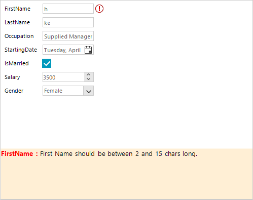

# Customizing Appearance

Accessing and customizing elements can be performed either at design time, or at run time. Before proceeding with this topic, it is recommended to get familiar with the [visual structure]() of the RadDataEntry.

## Design Time

You can access and modify the style for different elements in __RadDataEntry__ by using the `Element Hierarchy Editor`.

>caption Figure 1: Element Hierarchy Editor

   

## Programmatically

The following snippet show how you can customize the RadDataEntry styles at runtime. 

#### Change Border Color

{{source=..\SamplesCS\DataEntryAndBindingNavigator\RadDataEntryHowTo.cs region=SetBorderColor}} 
{{source=..\SamplesVB\DataEntryAndBindingNavigator\RadDataEntryHowTo.vb region=SetBorderColor}}
````C#
radDataEntry1.DataEntryElement.Border.ForeColor = ColorTranslator.FromHtml("#e83737");

````
````VB.NET
radDataEntry1.DataEntryElement.Border.ForeColor = ColorTranslator.FromHtml("#e83737")

```` 

{{endregion}}

>caption Figure 2: The changed border.

  

## Changing The Styles Of The Underlying Controls. 

The following snippet shows how you access the underlying controls and change the their styles:

#### Set Labels ForeColor

{{source=..\SamplesCS\DataEntryAndBindingNavigator\RadDataEntryHowTo.cs region=LabelColor}} 
{{source=..\SamplesVB\DataEntryAndBindingNavigator\RadDataEntryHowTo.vb region=LabelColor}}
````C#
foreach (RadPanel item in radDataEntry1.PanelContainer.Controls)
{
    foreach (RadControl control in item.Controls)
    {
        if (control is RadLabel)
        {
            control.ForeColor = ColorTranslator.FromHtml("#e83737");
        }
    }
}

````
````VB.NET
For Each item As RadPanel In radDataEntry1.PanelContainer.Controls
    For Each control As RadControl In item.Controls
        If TypeOf control Is RadLabel Then
            control.ForeColor = ColorTranslator.FromHtml("#e83737")
        End If
    Next control
Next item

````
 

{{endregion}}

>caption Figure 3: Set Labels ForeColor.

  

## Changing Validation Panel BackColor

The following code snippets represent how to change the BackColor property of Validation Panel:

### Change Back Color

{{source=..\SamplesCS\DataEntryAndBindingNavigator\RadDataEntryHowTo.cs region=ChangeBackColor}} 
{{source=..\SamplesVB\DataEntryAndBindingNavigator\RadDataEntryHowTo.vb region=ChangeBackColor}}
````C#
this.radDataEntry1.ValidationPanel.PanelElement.Fill.BackColor = Color.PapayaWhip;

````
````VB.NET
Me.radDataEntry1.ValidationPanel.PanelElement.Fill.BackColor = Color.PapayaWhip

```` 

{{endregion}}

>caption Figure 4: Set Validaton Panel BackColor.

  

# See Also

 * [Structure]()
 * [Getting Started]()
 * [Properties, events and attributes]()
 * [Themes]()
 * [Change the editor to RadDropDownList]()
