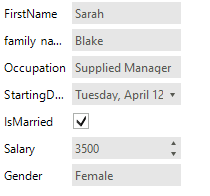
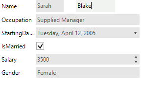

# Programmatically Arrange Items

Items in __RadDataEntry__ can be arranged both at design time and run time. At design time users can use the designer to arrange the items according to their needs by drag and drop or by setting the desired properties of the items. However at run time there is no designer that can be used to arrange them, so to achieve the desired layout the user should use the exposed events or to access the controls from the __Controls__ collection and to change their location, size and etc. The following example will demonstrate how to use the control events to arrange the generated items.

1\. For the purpose of this tutorial, we will create a new class Employee with a couple of exposed properties. By binding __RadDataEntry__ to object from this type we will generate several items.

#### Data Object

{{source=..\SamplesCS\DataEntryAndBindingNavigator\RadDataEntryGettingStarted.cs region=empl1}} 
{{source=..\SamplesVB\DataEntryAndBindingNavigator\RadDataEntryGettingStarted.vb region=empl1}} 

````C#
private class Employee
{
    public string FirstName
    {
        get;
        set;
    }
    public string LastName
    {
        get;
        set;
    }
    public string Occupation
    {
        get;
        set;
    }
    public DateTime StartingDate
    {
        get;
        set;
    }
    public bool IsMarried
    {
        get;
        set;
    }
    public int Salary
    {
        get;
        set;
    }
    public Gender Gender
    {
        get;
        set;
    }
}
private enum Gender
{
    Female,
    Male
}

````
````VB.NET
Private Class Employee
    Public Property FirstName() As String
        Get
            Return m_FirstName
        End Get
        Set(value As String)
            m_FirstName = Value
        End Set
    End Property
    Private m_FirstName As String
    Public Property LastName() As String
        Get
            Return m_LastName
        End Get
        Set(value As String)
            m_LastName = Value
        End Set
    End Property
    Private m_LastName As String
    Public Property Occupation() As String
        Get
            Return m_Occupation
        End Get
        Set(value As String)
            m_Occupation = Value
        End Set
    End Property
    Private m_Occupation As String
    Public Property StartingDate() As DateTime
        Get
            Return m_StartingDate
        End Get
        Set(value As DateTime)
            m_StartingDate = Value
        End Set
    End Property
    Private m_StartingDate As DateTime
    Public Property IsMarried() As Boolean
        Get
            Return m_IsMarried
        End Get
        Set(value As Boolean)
            m_IsMarried = Value
        End Set
    End Property
    Private m_IsMarried As Boolean
    Public Property Salary() As Integer
        Get
            Return m_Salary
        End Get
        Set(value As Integer)
            m_Salary = Value
        End Set
    End Property
    Private m_Salary As Integer
    Public Property Gender() As Gender
        Get
            Return m_Gender
        End Get
        Set(value As Gender)
            m_Gender = Value
        End Set
    End Property
    Private m_Gender As Gender
End Class
Private Enum Gender
    Female
    Male
End Enum

````

{{endregion}} 

#### Data Binding 

{{source=..\SamplesCS\DataEntryAndBindingNavigator\RadDataEntryGettingStarted.cs region=bind1}} 
{{source=..\SamplesVB\DataEntryAndBindingNavigator\RadDataEntryGettingStarted.vb region=bind1}} 

````C#
this.radDataEntry1.DataSource = new Employee() 
{ 
    FirstName = "Sarah",
    LastName = "Blake",
    Occupation = "Supplied Manager", 
    StartingDate = new DateTime(2005, 04, 12),
    IsMarried = true, 
    Salary = 3500, Gender = Gender.Female 
};

````
````VB.NET
Me.radDataEntry1.DataSource = New Employee() With { _
  .FirstName = "Sarah", _
  .LastName = "Blake", _
  .Occupation = "Supplied Manager", _
  .StartingDate = New DateTime(2005, 4, 12), _
  .IsMarried = True, _
  .Salary = 3500, _
  .Gender = Gender.Female _
 }

````

{{endregion}} 

>caption Figure 1. RadDataEntry is initialized.



2\. To arrange the items we will subscribe to the *ItemInitialized* event of __RadDataEntry__. This event is triggered when an item is initialized, so it is suitable to introduce changes.

#### Special Arrangement

{{source=..\SamplesCS\DataEntryAndBindingNavigator\RadDataEntryHowTo.cs region=ItemInitialized}} 
{{source=..\SamplesVB\DataEntryAndBindingNavigator\RadDataEntryHowTo.vb region=ItemInitialized}} 

````C#
void radDataEntry1_ItemInitialized(object sender, Telerik.WinControls.UI.ItemInitializedEventArgs e)
{
    if (e.Panel.Controls[1].Text == "FirstName")
    {
        e.Panel.Size = new Size(150, 25);
        e.Panel.Controls[1].Text = "Name";
    }
    else if (e.Panel.Controls[1].Text == "LastName")
    {
        e.Panel.Size = new Size(100, 25);
        e.Panel.Controls[1].Visible = false;
        e.Panel.Location = new Point(160, radDataEntry1.ItemSpace);
    }
    else
    {
        e.Panel.Location = new Point(e.Panel.Location.X, e.Panel.Location.Y - 25);
    }
}

````
````VB.NET
Private Sub radDataEntry1_ItemInitialized(sender As Object, e As Telerik.WinControls.UI.ItemInitializedEventArgs)
    If e.Panel.Controls(1).Text = "FirstName" Then
        e.Panel.Size = New Size(150, 25)
        e.Panel.Controls(1).Text = "Name"
    ElseIf e.Panel.Controls(1).Text = "LastName" Then
        e.Panel.Size = New Size(100, 25)
        e.Panel.Controls(1).Visible = False
        e.Panel.Location = New Point(160, radDataEntry1.ItemSpace)
    Else
        e.Panel.Location = New Point(e.Panel.Location.X, e.Panel.Location.Y - 25)
    End If
End Sub

````

{{endregion}} 

>caption Figure 2. The whole name is now displayed in the first row. 



# See Also

 * [Structure]()
 * [Getting Started]()
 * [Properties, events and attributes]()
 * [Validation]()
 * [Themes]()
 * [Change the editor to RadDropDownList]()
