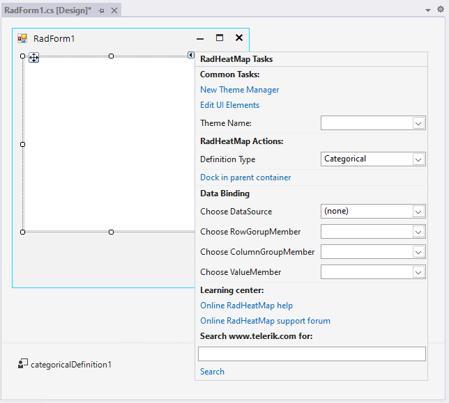

# Design Time

To start using **RadHeatMap**, just drag it from the toolbox and drop it onto the form.

>note CategoricalDefinition is added automatically to the components tray. When the Definition type is changed in the Action list, the RadHeatMap.Definition is regenerated. 

## Smart Tag

Select **RadHeatMap** and click the small arrow on the top right position in order to open the Smart Tag.
 

* **Common Tasks**

	* New Theme Manager: Adds a new RadThemeManager component to the form.

	* Edit UI elements: Opens a dialog that displays the Element Hierarchy Editor. This editor lets you browse all the elements in the control.

	* Theme Name: Select a theme name from the drop down list of themes available for that control. Selecting a theme allows you to change all aspects of the controls visual style at one time.

* **RadHeatMap Actions**

	* Definition Type: Specifies the heat map definition. The definition is responsible for managing the data and displaying the data in rows and columns. The available options are Categorical, Horizontal and Vertical. 

* **Data Binding** - It is possible to bind RadHeatMap at design time by specifying the DataSource. According to the selected *Definition type*, different members should be set respectively. 

 

	* **CategoricalDefinition**: requires specifying the following members:
		* **RowGroupMember**: Gets or sets the name of the property which determines the row-category of a cell. 
		* **ColumnGroupMember**: Gets or sets the name of the property which determines the column-category of a cell.  
		* **ValueMember**: Gets or sets the name of the property which determines the value of a cell. 
	
	* **VerticalDefinition** and **HorizontalDefinition**: require specifying the following member:
		* **HeaderMember**: Gets or sets the name of the property which determines the header-string.

	* **Edit Member Mappings**: opens the MemberMapping Collection Editor

 

RadHeatMap supports data binding either at design time or at run time.

* **Learning Center**: Navigate to the Telerik help, code library projects or support forum.

* **Search**: Search the Telerik site for a given string.

## See Also

* [Structure]()  
* [Custom Painting]() 
* [Colorizers]()

