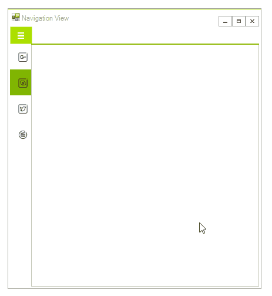
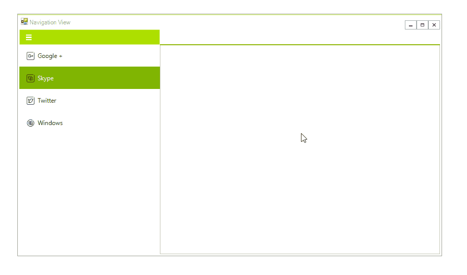

# Display Modes

The NavigationView supports four modes - *Auto*, *Minimal*, *Compact*, *Expanded*. This article describes all modes in details.

## Auto 

This mode switches between the other modes depending on the available free space. By default if the width is bellow 641 the *Minimal* mode is used. If the width is between  641 and 1008 the *Compact* mode is used. If there are more that 1008 pixels available the *Expanded* mode is used. 

## Minimal

With this mode the pages items are displayed in popup, only the header and the hamburger button are visible. This is the default view when the overall width of the control is less than or equal to 640 pixels.  

## Compact

This mode displays only the icons of the pages items. The icons are always visible in this mode. When expanded the pane appears as a popup above the content area.This should be the default view when the overall width of the control is between 641px and 1007px.

## Expanded

With this mode both the icons and the text of the items is displayed. The pane can be collapsed which will display only the icons and will free more space. When the pane is expanded or collapsed the content area changes its size. This should be the default view when the overall width of the control is greater than 1008px.

# See Also
* [Getting Started]()
* [Properties]()
