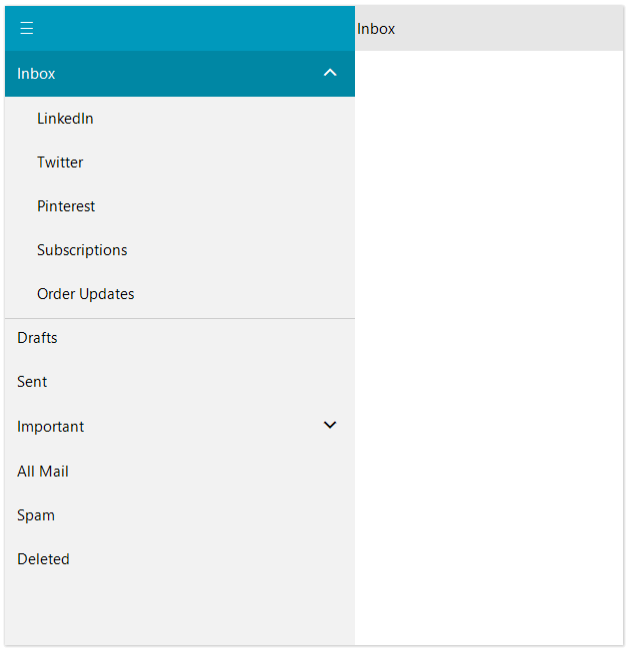
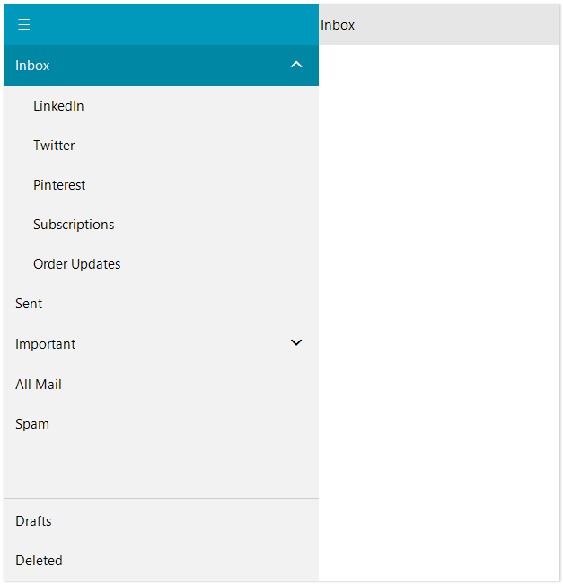

# Header and Footer

**RadNavigationView** control offers header and footer area. The header and footer are separated by a separator from the other elements so that they can be visually identifiable. The user can easily pin items into the header or footer. The pinned items are always visible. Even if there is a scrollbar the pinned items remain always visible on top of the scrollbar. 

### Add items to the Header area

In order to pin items into the header area you can use any of the following options:
* **PinPostion** - Determines whether to pin the item into the header or into the footer.
* **PinPage** - Pins the page item into the specified pin position.
* **PinItem** - Pins the item into the specified pin position.
* **AddHeaderPage** - Adds a page to the header area.
* **AddHeaderItem** - Adds an item to the header area.

The following examples demonstrate how to manage the item's position using the hierarchy setup shown [here]().

#### Add items to the Header

{{source=..\SamplesCS\PageView\NavigationView.cs region=PinHeaderItems}} 
{{source=..\SamplesVB\PageView\NavigationView.vb region=PinHeaderItems}} 

````C#
(inboxPage.Item as RadPageViewNavigationViewItem).PinPosition = NavigationViewItemPinPosition.Header;
this.radNavigationView1.PinPage(inboxPage, NavigationViewItemPinPosition.Header);
this.radNavigationView1.PinItem(inboxPage.Item, NavigationViewItemPinPosition.Header);
this.radNavigationView1.AddHeaderPage(inboxPage);
this.radNavigationView1.AddHeaderItem(inboxPage.Item);

````
````VB.NET
TryCast(Me.inboxPage.Item, RadPageViewNavigationViewItem).PinPosition = NavigationViewItemPinPosition.Header
Me.radNavigationView1.PinPage(Me.inboxPage, NavigationViewItemPinPosition.Header)
Me.radNavigationView1.PinItem(Me.inboxPage.Item, NavigationViewItemPinPosition.Header)
Me.radNavigationView1.AddHeaderPage(Me.inboxPage)
Me.radNavigationView1.AddHeaderItem(Me.inboxPage.Item)

````

{{endregion}}



>note PinPostion, PinPage, and PinItem can be used for pinning items in both Header/Footer, as well as unpin items.

### Add items to the Footer area

In order to pin items into the footer area you can use any of the following options:
* **PinPostion** - Determines whether to pin the item into the header or into the footer.
* **PinPage** - Pins the page item into the specified pin position.
* **PinItem** - Pins the item into the specified pin position.
* **AddFooterPage** - Adds a page to the footer area.
* **AddFooterItem** - Adds an item to the footer area.

#### Add items to the Footer

{{source=..\SamplesCS\PageView\NavigationView.cs region=PinFooterItems}} 
{{source=..\SamplesVB\PageView\NavigationView.vb region=PinFooterItems}} 

````C#
(draftsPage.Item as RadPageViewNavigationViewItem).PinPosition = NavigationViewItemPinPosition.Footer;
this.radNavigationView1.PinPage(draftsPage, NavigationViewItemPinPosition.Footer);
this.radNavigationView1.PinItem(draftsPage.Item, NavigationViewItemPinPosition.Footer);
this.radNavigationView1.AddFooterPage(draftsPage);
this.radNavigationView1.AddFooterItem(draftsPage.Item);
this.radNavigationView1.AddFooterItem(deletedPage.Item);

````
````VB.NET
TryCast(Me.draftsPage.Item, RadPageViewNavigationViewItem).PinPosition = NavigationViewItemPinPosition.Footer
Me.radNavigationView1.PinPage(Me.draftsPage, NavigationViewItemPinPosition.Footer)
Me.radNavigationView1.PinItem(Me.draftsPage.Item, NavigationViewItemPinPosition.Footer)
Me.radNavigationView1.AddFooterPage(Me.draftsPage)
Me.radNavigationView1.AddFooterItem(Me.draftsPage.Item)
Me.radNavigationView1.AddFooterItem(Me.deletedPage.Item)

````

{{endregion}}



>note Drag and drop can be used to reorder items in the Header/Footer area.

### Unpin Items

In order to unpin items that have already been pinned, you can use again **PinPostion**, **PinPage**, **PinItem** and specify **NavigationViewItemPinPosition.None**. You can use also the following methods:

* **UnpinPage** -  Unpins a page.
* **UnpinItem** -  Unpins a page item.

#### Unpin Items

{{source=..\SamplesCS\PageView\NavigationView.cs region=UnpinItems}} 
{{source=..\SamplesVB\PageView\NavigationView.vb region=UnpinItems}} 

````C#
(this.draftsPage.Item as RadPageViewNavigationViewItem).PinPosition = NavigationViewItemPinPosition.None;
this.radNavigationView1.PinPage(this.draftsPage, NavigationViewItemPinPosition.None);
this.radNavigationView1.PinItem(this.draftsPage.Item, NavigationViewItemPinPosition.None);
this.radNavigationView1.UnpinPage(this.draftsPage);
this.radNavigationView1.UnpinItem(this.draftsPage.Item);

````
````VB.NET
TryCast(Me.draftsPage.Item, RadPageViewNavigationViewItem).PinPosition = NavigationViewItemPinPosition.None
Me.radNavigationView1.PinPage(Me.draftsPage, NavigationViewItemPinPosition.None)
Me.radNavigationView1.PinItem(Me.draftsPage.Item, NavigationViewItemPinPosition.None)
Me.radNavigationView1.UnpinPage(Me.draftsPage)
Me.radNavigationView1.UnpinItem(Me.draftsPage.Item)

````

{{endregion}}


* [Navigation View]()	 
* [Structure]()
* [Hierarchy Support]()
