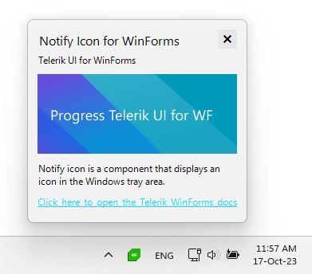

# Popup

The __RadNotifyIcon__ allows for displaying a popup upon interacting with the icon or by manually calling the exposed methods. 

## PopupContent 

The __PopupContent__ property allow for setting the popup's content and changing its default look. The **PopupContent** property is of type **Control**. This way you can design your Form, UserControl, etc. and set it as a content of the popup.

{{source=..\SamplesCS\NotifyIcon\Features.cs region=PopupContent}} 
{{source=..\SamplesVB\NotifyIcon\Features.vb region=PopupContent}}
````C#

void ShowNotifyIconPopup()
{
	RadNotifyIcon radNotifyIcon = new RadNotifyIcon();
	radNotifyIcon.TrayIcon = new System.Drawing.Icon("../../WinForms128x28.ico");
	radNotifyIcon.PopupContent = new UserControl1();
	radNotifyIcon.ShowTrayIcon = true;
}

````
````VB.NET

Private Sub ShowNotifyIconPopup()
    Dim radNotifyIcon As RadNotifyIcon = New RadNotifyIcon()
    radNotifyIcon.TrayIcon = New System.Drawing.Icon("../../WinForms128x28.ico")
    radNotifyIcon.PopupContent = New UserControl1()
    radNotifyIcon.ShowTrayIcon = True
End Sub


```` 

{{endregion}}


#### __Figure 1: RadNotifyIcon with Popup__ (Windows 11 OS)



## PopupActivationMouseEvent

The __PopupActivationMouseEvent__ property determines when the popup will be shown. The default value is __LeftClick__. This property is enumeration and it expose the following values:
* __LeftClick__: Triggered on left mouse click.
* __RightClick__: Triggered on right mouse click.
* __MiddleClick__: Triggered on middle mouse click.
* __LeftDoubleClick__: Triggered on left mouse double click.
* __RightDoubleClick__: Triggered on right mouse double click.
* __MiddleDoubleClick__: Triggered on middle mouse double click.
* __All__: Triggered on any mouse click action.


{{source=..\SamplesCS\NotifyIcon\Features.cs region=PopupActivationMouseEvent}} 
{{source=..\SamplesVB\NotifyIcon\Features.vb region=PopupActivationMouseEvent}}
````C#

radNotifyIcon.PopupActivationMouseEvent = MouseActivationEvent.All;


````
````VB.NET

radNotifyIcon.PopupActivationMouseEvent = MouseActivationEvent.All


```` 

{{endregion}}

## PopupShowDuration

The __PopupShowDuration__ specifies the amount of time in __milliseconds__ after which the popup will begin to close automatically. The default value is __5000__ milliseconds (5s). 

{{source=..\SamplesCS\NotifyIcon\Features.cs region=PopupShowDuration}} 
{{source=..\SamplesVB\NotifyIcon\Features.vb region=PopupShowDuration}}
````C#

radNotifyIcon.PopupShowDuration = 3000;


````
````VB.NET

radNotifyIcon.PopupShowDuration = 3000


```` 

{{endregion}}

## PopupCloseMode

The __PopupCloseMode__ is a bitwise enumeration, which controls the actions that will close the popup. The possible values are:

* **None**: The popup can only be closed in code (with the __HidePopup__ method) or by clicking on the notify icon. 
* **Deactivate**: The popup can be closed by clicking outside of it or by deactivating it with a windows keyboard shortcut.
* **Timeout**: The popup will be closed after the time specified by the __PopupShowDuration__ runs out. This is the default value.

## Programmatically Showing the Popup

The RadNotifyIcon allows for programmatically showing a popup through the __ShowPopup__ method. It exposes one overload, which provides the option of specifying a screen location. 

* **void ShowPopup()**: Shows the popup on top of the notify icon.
* **void ShowPopup(Point location)**: Shows the popup at the provided location.

{{source=..\SamplesCS\NotifyIcon\Features.cs region=ShowPopup}} 
{{source=..\SamplesVB\NotifyIcon\Features.vb region=ShowPopup}}
````C#
radNotifyIcon.ShowPopup();

````
````VB.NET
radNotifyIcon.ShowPopup()

```` 

{{endregion}}

## Programmatically Hiding the Popup

You can manually hide the popup with the __HidePopup__ method as shown in __Example 6__.

{{source=..\SamplesCS\NotifyIcon\Features.cs region=HidePopup}} 
{{source=..\SamplesVB\NotifyIcon\Features.vb region=HidePopup}}
````C#

radNotifyIcon.HidePopup();

````
````VB.NET

radNotifyIcon.HidePopup()

```` 

{{endregion}}

## Popup Animations

You can control the opening and closing animation with the __PopupShowAnimation__ and __PopupHideAnimation__ properties respectively. These properties are enumeration (**NotifyIconAnimationType**) and it expose the following values:
* **None**: No animation.
* **Fade**: A Fade animation is applied.
* **Timeout**: A 'Slide' animation is applied.

{{source=..\SamplesCS\NotifyIcon\Features.cs region=PopupAnimation}} 
{{source=..\SamplesVB\NotifyIcon\Features.vb region=PopupAnimation}}
````C#

radNotifyIcon.PopupShowAnimation = NotifyIconAnimationType.Slide;
radNotifyIcon.PopupHideAnimation = NotifyIconAnimationType.Fade;

````
````VB.NET

radNotifyIcon.PopupShowAnimation = NotifyIconAnimationType.Slide
radNotifyIcon.PopupHideAnimation = NotifyIconAnimationType.Fade

```` 

{{endregion}}

#### __Figure 2: Show/Hide Animation__ (Windows 10 OS)


## IsPopupOpen

The __IsPopupOpen__ property allows you to check whether a popup is currently open.


## See Also 

* [Tooltip]()