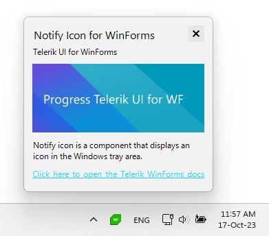

# WinForms NotifyIcon Overview

**RadNotifyIcon** is a control that can be used to display an icon in the Windows taskbar notification area. The icon can then respond to user's interaction as well as display tooltips, popups and balloon notifications.





### Key features:

Add an icon in the Windows taskbar notification area. Learn more in the [Getting Started]() article.

* **Popup**: Display a popup upon user interaction with the icon or by manually calling the exposed methods. Learn more in the [Popup]() article.

* **ContextMenu**: Show a popup to present the user with some options. Learn more in the [ContextMenu]() article.

* **Tooltip**: Display a tooltip when the icon is hovered and customize it. Check out the [Tooltip]() article for more information.

* **Balloon Notifications**: Show a notification to grab the user's attention. Check out the [Balloon Notifications]() article for more information.

* **DPI Support**: RadNotifyIcon provides support for high DPI environments.

## Telerik UI for WinForms Learning Resources
* [Telerik UI for WinForms NotifyIcon Homepage](https://www.telerik.com/products/winforms/notifyicon.aspx)
* [Get Started with the Telerik UI for WinForms NotifyIcon]()
* [Telerik UI for WinForms API Reference](https://docs.telerik.com/devtools/winforms/api/)
* [Getting Started with Telerik UI for WinForms Components]()
* [Telerik UI for WinForms Virtual Classroom (Training Courses for Registered Users)](https://learn.telerik.com/learn/course/external/view/elearning/17/TelerikUIforWinForms) 
* [Telerik UI for WinForms Forum](https://www.telerik.com/forums/winforms)
* [Telerik UI for WinForms Knowledge Base](https://docs.telerik.com/devtools/winforms/knowledge-base)

## Telerik UI for WinForms Additional Resources
* [Telerik UI for WinForms Product Overview](https://www.telerik.com/products/winforms.aspx)
* [Telerik UI for WinForms Blog](https://www.telerik.com/blogs/desktop-winforms)
* [Telerik UI for WinForms Videos](https://www.telerik.com/videos/product/winforms)
* [Telerik UI for WinForms Roadmap](https://www.telerik.com/support/whats-new/winforms/roadmap)
* [Telerik UI for WinForms Pricing](https://www.telerik.com/purchase/individual/winforms.aspx)
* [Telerik UI for WinForms Code Library](https://www.telerik.com/support/code-library/winforms)
* [Telerik UI for WinForms Support](https://www.telerik.com/support/winforms)
* [What’s New in Telerik UI for WinForms](https://www.telerik.com/support/whats-new/winforms)

## See Also

* [Design Time]()
* [Getting Started]()
* [Tooltip]()

