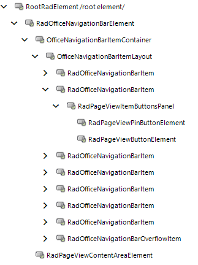

# Structure

This article describes the inner structure and organization of the elements which build **RadOfficeNavigationBar**.

* **RadOfficeNavigationBarElement** - the main element in **RadOfficeNavigationBar**.
	* **OfficeNavigationBarItemContainer** - holds the items and their content area. 
		* **OfficeNavigationBarItemLayout** - represents the StripViewItemContainer that holds all the items.
			* **RadOfficeNavigationBarItem** - represents a separate office item.
			* **RadOfficeNavigationBarOverflowItem** - represents the options/ overflow button ("**...**") that allows the user navigate through the hidden items in the navigation bar. When you click the item, a RadContextMenuDropDown is shown.

		* **RadPageViewContentAreaElement** - represents the content area that is relevant to the currently selected office item.

# Elements Hierarchy

# See Also

* [View Modes]()	
* [Design Time]()	
* [Getting Started]()	

