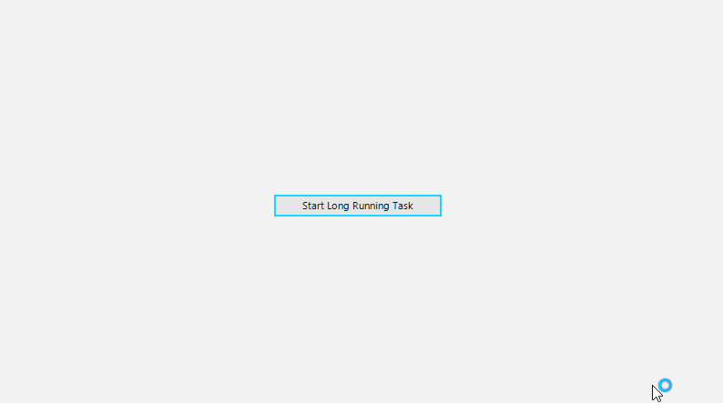

# Getting Started

This tutorial will walk you through how you can customize the __Overlay Screen__ Form. The __RadOverlayManager__ static class expose two events which can be used to get the default Form of the __Overlay Screen__. In the following example we will subscribe to the FormShown event. In the event handler arguments holds an instance of the Form. 

>caution Note that both events are created on a separate __System.Threading.Threads__ and it is required to use BeginInvoke/Invoke when accessing it in order to prevent cross-thread exceptions. Also, these events are static and you need to explicitly unsubscribe from them in order to prevent memory leaks. Each object that is subscribed to one of these events cannot be garbage collected.



## Show Overlay

{{source=..\SamplesCS\SplashScreens\Overlay\OverlaySettings.cs region=Customize_Appearance}} 
{{source=..\SamplesVB\SplashScreens\Overlay\OverlaySettings.vb region=Customize_Appearance}} 

````C#

private void ShowOverlay()
{
	RadOverlayManager.FormShown -= RadOverlayManager_FormShown;
    RadOverlayManager.FormShown += RadOverlayManager_FormShown;
    RadOverlayManager.Show(this.radGridView1);            
}

private void RadOverlayManager_FormShown(SplashFormEventArgs e)
{
    Dispatcher.CurrentDispatcher.BeginInvoke((Action)(()=> {
        (e.Form as RadOverlayForm).Opacity = 0.90;
		(e.Form as RadOverlayForm).WaitingBar.WaitingSpeed = 25;
        (e.Form as RadOverlayForm).WaitingBar.WaitingStyle = Telerik.WinControls.Enumerations.WaitingBarStyles.SegmentedRing;
    }));
}
	

````
````VB.NET

Private Sub ShowOverlay()

    RemoveHandler RadOverlayManager.FormShown, AddressOf RadOverlayManager_FormShown
	AddHandler RadOverlayManager.FormShown, AddressOf RadOverlayManager_FormShown	
	RadOverlayManager.Show(Me.radGridView1)
End Sub

Private Sub RadOverlayManager_FormShown(ByVal e As SplashFormEventArgs)
	Dispatcher.CurrentDispatcher.BeginInvoke(CType((Function()
														(TryCast(e.Form, RadOverlayForm)).Opacity = 0.90
														(TryCast(e.Form, RadOverlayForm)).WaitingBar.WaitingSpeed = 25
														(TryCast(e.Form, RadOverlayForm)).WaitingBar.WaitingStyle = Telerik.WinControls.Enumerations.WaitingBarStyles.SegmentedRing
													End Function), Action))
End Sub


````

{{endregion}}


# See Also

* [Overview]()
 
        
