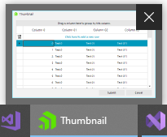
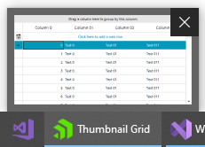

# Thumbnail

The preview window is shown when the user hovers the taskbar button of the application with the mouse:

 

## Preview Image

This is the main part of the thumbnail representing a small preview of the application. Setting the **ClipControl** property allows you to focus on a particular control to be used for the preview, e.g. a RadGridView control:

 

The **ClipRectangle** property allows you to specify a specific part of the control to be displayed in the preview.  

>caution Note that when the **ClipRectangle** property is assigned the **ClipControl** property will be reset.

## Thumbnail Buttons

RadTaskbarButton can display buttons in its thumbnail part. Adding buttons to your thumbnail preview will be an excellent enhancement to your application. This way the user can call commands in your application without restoring or activating the application's window. To add thumbnail button, you can populate the __ThumbnailButtons__ collection of the control.

>caption Figure 1: Thumbnail Buttons


#### Adding Thumbnail Buttons

{{source=..\SamplesCS\TaskbarButton\TaskbarButtonGettingStarted.cs region=ThumbnailButtons}} 
{{source=..\SamplesVB\TaskbarButton\TaskbarButtonGettingStarted.vb region=ThumbnailButtons}}

````C#

Telerik.WinControls.Taskbar.RadThumbnailButton radThumbnailButton1 = new Telerik.WinControls.Taskbar.RadThumbnailButton();
Telerik.WinControls.Taskbar.RadThumbnailButton radThumbnailButton2 = new Telerik.WinControls.Taskbar.RadThumbnailButton();
this.radTaskbarButton1.ThumbnailButtons.Add(radThumbnailButton1);
this.radTaskbarButton1.ThumbnailButtons.Add(radThumbnailButton2);

````
````VB.NET

Dim radThumbnailButton1 As Telerik.WinControls.Taskbar.RadThumbnailButton = New Telerik.WinControls.Taskbar.RadThumbnailButton()
Dim radThumbnailButton2 As Telerik.WinControls.Taskbar.RadThumbnailButton = New Telerik.WinControls.Taskbar.RadThumbnailButton()
Me.RadTaskbarButton1.ThumbnailButtons.Add(radThumbnailButton1)
Me.RadTaskbarButton1.ThumbnailButtons.Add(radThumbnailButton2

````

{{endregion}}

 
To add image content to the buttons, you can populate the __ThumbnailButtonsImageList__ collection of the __RadTaskbarButton__ with the required images. Then, you can set the ImageIndex property of each button to the index of image inside the collection.
 
{{source=..\SamplesCS\TaskbarButton\TaskbarButtonGettingStarted.cs region=Thumbnail_Image}} 
{{source=..\SamplesVB\TaskbarButton\TaskbarButtonGettingStarted.vb region=Thumbnail_Image}}

````C#

var images = new ImageList();
images.Images.Add(new Bitmap("../../ProgressIcon.ico"));
images.Images.Add(new Bitmap("../../WinFormsIcon.ico"));
this.radTaskbarButton1.ThumbnailButtonsImageList = images;
this.radTaskbarButton1.ThumbnailButtons[0].ImageIndex = 0;
this.radTaskbarButton1.ThumbnailButtons[1].ImageIndex = 1;


````
````VB.NET

Dim images = New ImageList()
images.Images.Add(New Bitmap("../../ProgressIcon.ico"))
images.Images.Add(New Bitmap("../../WinFormsIcon.ico"))
Me.RadTaskbarButton1.ThumbnailButtonsImageList = images
Me.RadTaskbarButton1.ThumbnailButtons(0).ImageIndex = 0
Me.RadTaskbarButton1.ThumbnailButtons(1).ImageIndex = 1

````

{{endregion}}

>caution Note that once thumbnail buttons are added to the TnumbnailButtons collection and submitted to the application, they no longer can be modified. Only can be hidden by setting the Hidden property.

## RadThumbnailButton's API  

|Property|Description|
|----|----|
|**Owner**|Gets the owner of the thumbnail button.|
|**Tag**|Tag object that can be used to store user data, taht correcposnds to this button.|
|**ImageIndex**|Gets or sets the image list index value of the image displayed on the button control.|
|**ImageKey**|Gets or sets the key accessor for the image in the ImageList.|
|**Icon**|Gets or sets the System.Drawing.Icon displayed in this button.|
|**ToolTip**|Gets or sets the tool tip text.|
|**Enabled**|Gets or sets a value indicating, whether the buttons is enabled. If [true] The button is active and available to the user. If [false] The button is disabled. It is present, but has a visual state that indicates that it will not respond to user action.|
|**DismissOnClick**|When the button is clicked, the taskbar button's flyout closes immediately.|
|**NoBackground**|Do not draw a button border, use only the image.|
|**Hidden**|The button is not shown to the user.|
|**NonInteractive**|The button is enabled but not interactive; no pressed button state is drawn. This value is intended for instances where the button is used in a notification.|

## Click Event

To distinguish which button is clicked by the user and execute any application logic, you can subscribe to the **ThumbnailButtonClick** event of the RadTaskbarButton. In the event handler you can get the pressed button from the event arguments.

## Non Interactive State

There could be requirement to add non interactive icon in the buttons section inside the thumbnail preview. To simulate this effect you can use the NonBackground and NonInteractive properties. The first one will remove the border rectangle and mouse hover effects and the second one will disable the button press event. 

{{source=..\SamplesCS\TaskbarButton\TaskbarButtonGettingStarted.cs region=Non_Interactive_State}} 
{{source=..\SamplesVB\TaskbarButton\TaskbarButtonGettingStarted.vb region=Non_Interactive_State}}

````C#

this.radTaskbarButton1.ThumbnailButtons[0].NoBackground = true;
this.radTaskbarButton1.ThumbnailButtons[0].NonInteractive = true;


````
````VB.NET

Me.RadTaskbarButton1.ThumbnailButtons(0).NoBackground = True
Me.RadTaskbarButton1.ThumbnailButtons(0).NonInteractive = True

````

{{endregion}}

>caption Figure 3: NonInteractive Button


# See Also

* [Getting Started]()
* [Design Time]() 
 
        
