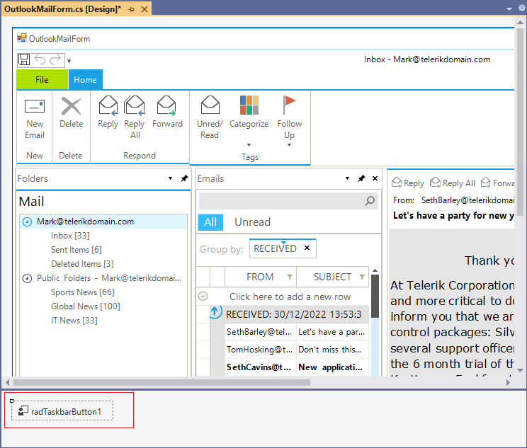
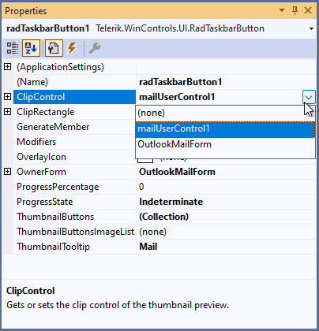
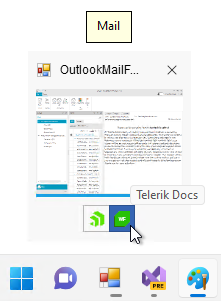

# Getting Started with WinForms Taskbar   

Before proceeding further with this article, it is recommended to get familiar with the Windows Taskbar's structure and how the different parts are being organized: [Structure]().

Let's consider that you already have an existing Windows Forms application. Otherwise, create a new project using one of the [Visual Studio Templates](). By default, when the application is running, the following button is shown in the Taskbar:

This article demonstrates how to customize this visual representation.

1\. Drag the **RadTaskbarButton** component from the Visual Studio Toolbox and drop it onto the form:

 

2\. Select the **RadTaskbarButton** component and in the Visual Studio Properties section select which control on the form (or the form itself) will be the **ClipControl**, specify the **ProgressState** and set the **ThumbnailTooltip**.

 

3\. Clicking the **ThumbnailButtons** opens the *RadThumbnailButton Collection Editor* from where you can add two RadThumbnailButtons:

 

4\. Save the changes and run the application:

 

5\. Setting the **OverlayIcon** in the Visual Studio Properties allows you to put an icon to the taskbar button:

 

>note RadTaskbarButton does not provide any UI element. It just offers convenient API for specifying the content displayed for your application on the [Windows Taskbar](https://learn.microsoft.com/en-us/windows/win32/uxguide/winenv-taskbar). The exact visualization depends on the Windows version. 

# See Also

* [Getting Started]()
* [Design Time]() 
* [Structure]() 
 
        
