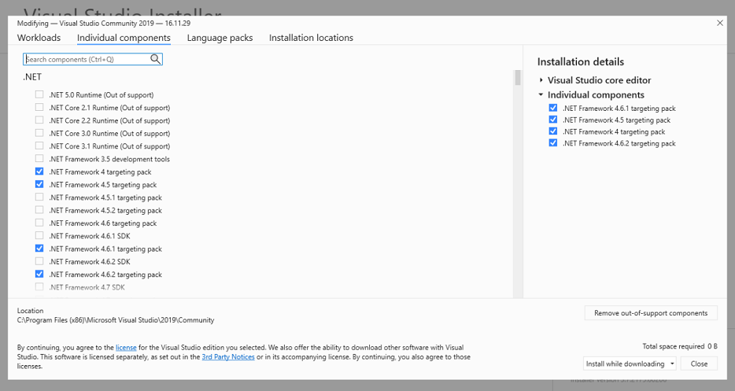

## Description

Sometimes our customers obtain errors that are not reproducible in a sample project. Due to the complexity of their project, connections to a local database etc., very often it is not possible for them to provide the exact application to the support engineers. Hence, it wouldn't be easy to determine what causes the unexpected behavior on their end.

The appropriate solution for investigating further the precise case is to download the Telerik source and attach it to the application that produces the error message. This would facilitate the investigation of the exact work flow of the project in this specific situation.

## Prerequisites to building the source code

### .NET Framework - WinForms.sln

* Visual Studio 2022 or Visual Studio 2019 

The following targeting packs need to be installed:  

* NET Framework 4.0 - Because of the Debug40 and Release40 configuration for all controls, we need the .NET Framework 4.0 reference assemblies. 

* NET Framework 4.5 - These reference assemblies are required by the ERP.Client project. 

* NET Framework 4.6.1 - These reference assemblies are required by the ToastNotificationManagerExamples project. 

* NET Framework 4.6.2 - These reference assemblies are required by the Examples.sln project. 

.NET Framework 4.0 and NET Framework 4.5 packs are not available in Visual Studio 2022, and they cannot be downloaded directly from Microsoft. A possible way to get them is to install Visual Studio 2019: https://learn.microsoft.com/en-us/visualstudio/releases/2019/compatibility#download. If VS2019 won't be used for development, installing only the targeting packs will be enough, no workloads need to be selected. 

Go to the Visual Studio installer, choose the VS2019 installation and modify it. In the Individual components tab and choose: 

* .NET Framework 4 targeting pack. 

* .NET Framework 4.5 targeting pack. 

* .NET Framework 4.6.1 targeting pack. 

* .NET Framework 4.6.2 targeting pack. 

At the end, inside Visual Studio 2019, you should have the following targeting packs installed. 

 

The targeting packs add reference assemblies here: C:\Program Files (x86)\Reference Assemblies\Microsoft\Framework\.NETFramework. This way they become available to all Visual Studio installations. 

### .NET - WinForms.NetCore.sln. 

Latest Visual Studio, at the time of this writing - Visual Studio 2022.
 
## Solution 

Please follow the steps described in the [Download Product Files]() help article in order to download the product files especially the source code:

Once you have the source code downloaded, let's continue with the following steps:

1\. Unzip the file in C:\sampleFolder. 

>caution When the Telerik WinForms source code is downloaded in some situations '.resx' files may be blocked with an error and the projects cannot be built. To unblock those files there is a simple solution for multiple-recursive unblocking: [Unblock .resx Files Downloaded in Telerik WinForms Source Code]()

 

>caution As of R3 2022 the zip contains not only the .NET Framework projects of the Telerik source code, but .NETCore projects as well. Make sure that you don't mix projects of different target framework when building the source code.
>

2\. In order to attach the source code to your project, you need to check what Telerik reference you have in your application:

3\. Afterwards, it is necessary to add these Telerik projects from the source code that you have just downloaded to your application by right clicking over the solution >> Add >> Existing project:

Navigate to the folder in which the extracted source code is located and select the necessary projects.

4\. Delete the existing Telerik references:

5\. Refer the added projects:

6\. Select the correct configuration - Debug40 for .NET Framework 4.0, Debug48 for .NET Framework 4.8:

7\. Rebuild the project. Now, you are ready to start debugging.

# See Also

* [Download Product Files]() 
* [How to Build Custom Telerik Assemblies when Using .NET Core and Enable Design Time Experience]()

