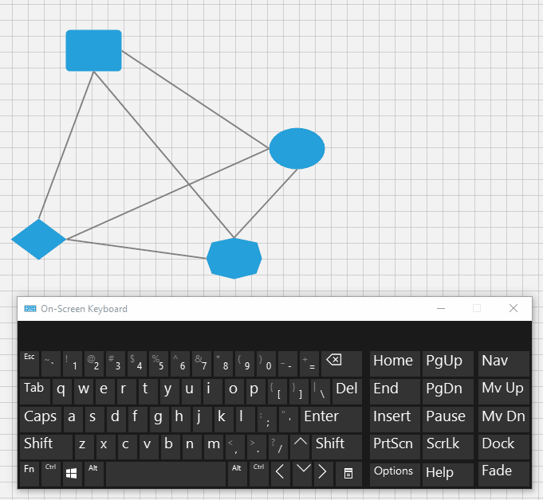

## Environment
|Product Version|Product|Author|
|----|----|----|
|2022.3.913|RadDiagram for WinForms|[Desislava Yordanova](https://www.telerik.com/blogs/author/desislava-yordanova)|

## Description

When a shape is selected in RadDiagram and the user hits the Delete key, only the **RadDiagramShape** is removed. All connections related to the shape remain. This article demonstrates how to delete the connections together with the shape after pressing Delete.
 

 

## Solution

**DiagramInputBehavior** is responsible for handling the user's input. Hence, we should create a derivative of **DiagramInputBehavior** and override its **HandleKeyDown**. When the Delete key is pressed, all selected shapes are iterated, their connections are removed. In the end, the selected shape is also deleted:
 
````C#

public RadForm1()
{
    InitializeComponent();

    this.radDiagram1.SelectionMode = Telerik.Windows.Diagrams.Core.SelectionMode.Multiple;
    this.radDiagram1.DiagramElement.InputBehavior = new CustomDiagramInputBehavior(this.radDiagram1.DiagramElement);
}

public class CustomDiagramInputBehavior : DiagramInputBehavior
{
    public CustomDiagramInputBehavior(RadDiagramElement diagramElement) : base(diagramElement)
    {
    }

    public override bool HandleKeyDown(KeyEventArgs e)
    {
        if (e.KeyData== Keys.Delete)
        {
            Console.WriteLine(DateTime.Now.ToLongTimeString());
            if (!this.DiagramElement.SelectedItems.Any(d => d.IsInEditMode == true))
            {
                List<RadDiagramShape> shapesToDelete = new List<RadDiagramShape>();
                foreach (RadDiagramItem item in this.DiagramElement.SelectedItems)
                {
                    RadDiagramShape shape = item as RadDiagramShape;
                    if (item == null)
                    {
                        continue;
                    }
                    
                    List<RadDiagramConnection> connectionsToDelete = new List<RadDiagramConnection>();
                    foreach (RadDiagramConnection connection in this.DiagramElement.Connections)
                    {
                        if (connection.Source == shape || connection.Target == shape)
                        {
                            connectionsToDelete.Add(connection);
                        }
                    }
                    while (connectionsToDelete.Count > 0)
                    {
                        this.DiagramElement.Items.Remove(connectionsToDelete.First());
                        connectionsToDelete.RemoveAt(0);
                    }
                    shapesToDelete.Add(shape);
                }
                while (shapesToDelete.Count > 0)
                {
                    this.DiagramElement.Items.Remove(shapesToDelete.First());
                    shapesToDelete.RemoveAt(0);
                }
                return true;
            }

        }
        return base.HandleKeyDown(e);
    }
}


````
````VB.NET

Public Sub New()
    InitializeComponent()
    Me.RadDiagram1.SelectionMode = Telerik.Windows.Diagrams.Core.SelectionMode.Multiple
    Me.RadDiagram1.DiagramElement.InputBehavior = New CustomDiagramInputBehavior(Me.RadDiagram1.DiagramElement)
End Sub

Public Class CustomDiagramInputBehavior
    Inherits DiagramInputBehavior

    Public Sub New(ByVal diagramElement As RadDiagramElement)
        MyBase.New(diagramElement)
    End Sub

    Public Overrides Function HandleKeyDown(ByVal e As KeyEventArgs) As Boolean
        If e.KeyData = Keys.Delete Then
            Console.WriteLine(DateTime.Now.ToLongTimeString())

            If Not Me.DiagramElement.SelectedItems.Any(Function(d) d.IsInEditMode = True) Then
                Dim shapesToDelete As List(Of RadDiagramShape) = New List(Of RadDiagramShape)()

                For Each item As RadDiagramItem In Me.DiagramElement.SelectedItems
                    Dim shape As RadDiagramShape = TryCast(item, RadDiagramShape)

                    If item Is Nothing Then
                        Continue For
                    End If

                    Dim connectionsToDelete As List(Of RadDiagramConnection) = New List(Of RadDiagramConnection)()

                    For Each connection As RadDiagramConnection In Me.DiagramElement.Connections

                        If connection.Source.Equals(shape) OrElse connection.Target.Equals(shape) Then
                            connectionsToDelete.Add(connection)
                        End If
                    Next

                    While connectionsToDelete.Count > 0
                        Me.DiagramElement.Items.Remove(connectionsToDelete.First())
                        connectionsToDelete.RemoveAt(0)
                    End While

                    shapesToDelete.Add(shape)
                Next

                While shapesToDelete.Count > 0
                    Me.DiagramElement.Items.Remove(shapesToDelete.First())
                    shapesToDelete.RemoveAt(0)
                End While

                Return True
            End If
        End If

        Return MyBase.HandleKeyDown(e)
    End Function
End Class


````

