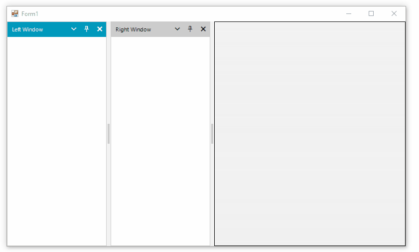

## Environment
|Product Version|Product|Author|
|----|----|----|
|2023.2.718|PivotGrid for WinForms|[Dinko Krastev](https://www.telerik.com/blogs/author/dinko-krastev)|


## Description

To auto-hide a __ToolWindow__, its pushpin icon needs to be clicked. This will cause the ToolWindow to auto-hide at the edge of the RadDock. By default, the __AutoHideWindow__ is expected to show without even clicking on the auto-hide tab. However, clicking on the auto-hide tab while the __AutoHideWindow__ is shown, will not close the popup. You will need to click somewhere else on the form and close the popup.



## Solution

You can subscribe to several methods to interfere with the auto-hide logic and close the __AutoHideWindow__ while clicking on its __TabStripItem__.

````C#

	public partial class Form1 : Form
    {
        RadDock radDock1 = new RadDock();
        public Form1()
        {
            InitializeComponent();
            radDock1.Dock = DockStyle.Fill;
            this.Controls.Add(radDock1);
            ToolWindow topRightWindow = new ToolWindow();
            topRightWindow.Text = "Left Window";
            radDock1.DockWindow(topRightWindow, DockPosition.Left);

            ToolWindow bottomRightWindow = new ToolWindow();
            bottomRightWindow.Text = "Right Window";
            radDock1.DockWindow(bottomRightWindow, topRightWindow,DockPosition.Right);
            this.radDock1.DockStateChanged += RadDock1_DockStateChanged;
        }
        private void RadDock1_DockStateChanged(object sender, DockWindowEventArgs e)
        {
            if(e.DockWindow.DockState == DockState.AutoHide)
            {
                this.radDock1.AutoHideWindowDisplaying -= RadDock_AutoHideWindowDisplaying;
                this.radDock1.AutoHideWindowDisplayed -= RadDock_AutoHideWindowDisplayed;
                this.radDock1.AutoHideWindowHidden -= RadDock_AutoHideWindowHidden;
                e.DockWindow.AutoHideTab.MouseDown -= TabStripMouseDown;

                this.radDock1.AutoHideWindowDisplaying += RadDock_AutoHideWindowDisplaying;
                this.radDock1.AutoHideWindowDisplayed += RadDock_AutoHideWindowDisplayed;
                this.radDock1.AutoHideWindowHidden += RadDock_AutoHideWindowHidden;
                e.DockWindow.AutoHideTab.MouseDown += TabStripMouseDown;
            }
        }
        private bool shown = false;
        private bool cancel = false;
        private void RadDock_AutoHideWindowDisplaying(object sender, Telerik.WinControls.UI.Docking.AutoHideWindowDisplayingEventArgs e)
        {
            Console.WriteLine("Displaying " + shown);
            if (cancel)
            {
                e.Cancel = true;
            }               
        }
        private void TabStripMouseDown(object sender, MouseEventArgs e)
        {
            if (shown)
            {
                cancel = true;
                shown = false;
                this.radDock1.CloseAutoHidePopup();
            }
            else
            {
                cancel = false;
            }               
        }
        private void RadDock_AutoHideWindowDisplayed(object sender, DockWindowEventArgs e)
        {
            cancel = false;
            shown = true;
        }
        private void RadDock_AutoHideWindowHidden(object sender, DockWindowEventArgs e)
        {
            shown = false;
        }
    }


````
````VB.NET


	Public Partial Class Form1
		Inherits Form
`
		Private radDock1 As RadDock = New RadDock()

		Public Sub New()
			InitializeComponent()
			radDock1.Dock = DockStyle.Fill
			Me.Controls.Add(radDock1)
			Dim topRightWindow As ToolWindow = New ToolWindow()
			topRightWindow.Text = "Left Window"
			radDock1.DockWindow(topRightWindow, DockPosition.Left)
			Dim bottomRightWindow As ToolWindow = New ToolWindow()
			bottomRightWindow.Text = "Right Window"
			radDock1.DockWindow(bottomRightWindow, topRightWindow, DockPosition.Right)
			Me.radDock1.DockStateChanged += AddressOf RadDock1_DockStateChanged
		End Sub

		Private Sub RadDock1_DockStateChanged(ByVal sender As Object, ByVal e As DockWindowEventArgs)
			If e.DockWindow.DockState = DockState.AutoHide Then
				Me.radDock1.AutoHideWindowDisplaying -= AddressOf RadDock_AutoHideWindowDisplaying
				Me.radDock1.AutoHideWindowDisplayed -= AddressOf RadDock_AutoHideWindowDisplayed
				Me.radDock1.AutoHideWindowHidden -= AddressOf RadDock_AutoHideWindowHidden
				e.DockWindow.AutoHideTab.MouseDown -= AddressOf TabStripMouseDown
				Me.radDock1.AutoHideWindowDisplaying += AddressOf RadDock_AutoHideWindowDisplaying
				Me.radDock1.AutoHideWindowDisplayed += AddressOf RadDock_AutoHideWindowDisplayed
				Me.radDock1.AutoHideWindowHidden += AddressOf RadDock_AutoHideWindowHidden
				e.DockWindow.AutoHideTab.MouseDown += AddressOf TabStripMouseDown
			End If
		End Sub

		Private shown As Boolean = False
		Private cancel As Boolean = False

		Private Sub RadDock_AutoHideWindowDisplaying(ByVal sender As Object, ByVal e As Telerik.WinControls.UI.Docking.AutoHideWindowDisplayingEventArgs)
			Console.WriteLine("Displaying " & shown)

			If cancel Then
				e.Cancel = True
			End If
		End Sub

		Private Sub TabStripMouseDown(ByVal sender As Object, ByVal e As MouseEventArgs)
			If shown Then
				cancel = True
				shown = False
				Me.radDock1.CloseAutoHidePopup()
			Else
				cancel = False
			End If
		End Sub

		Private Sub RadDock_AutoHideWindowDisplayed(ByVal sender As Object, ByVal e As DockWindowEventArgs)
			cancel = False
			shown = True
		End Sub

		Private Sub RadDock_AutoHideWindowHidden(ByVal sender As Object, ByVal e As DockWindowEventArgs)
			shown = False
		End Sub
	End Class


````


