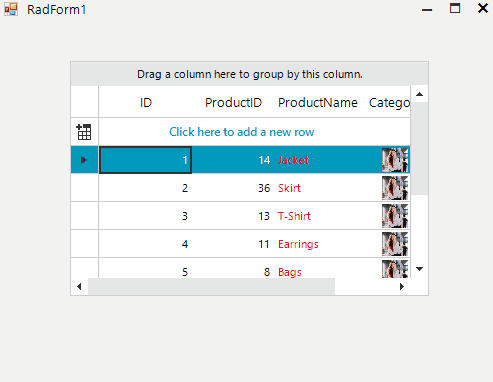
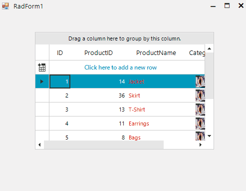

## Environment
|Product Version|Product|Author|
|----|----|----|
|2022.3.913|RadGridView for WinForms|Maria Terzieva|

## Description

A common requirement is to apply style settings to the RadGridView's cell elements. Using the CellFormatting event is a good approach to achieve it. However, the applied style settings might be applied to undesired cell elements after operations like scrolling, grouping, etc. 

>caption Undesired formatting
 

## Solution

Due to UI virtualization in RadGridView, the cell elements are created for only visible cells and reused during operations like scrolling, filtering, grouping, etc. 
In order to prevent applying the formatting to other columns cell elements all customization should be reset for the rest of the cell elements in the CellFormatting event, which is used to access and change the styles of the data cells  in the RadGridView. In other words, each "if" statement that applies certain style settings should have the respective "else" clause for resetting these settings.
Here is presented a .gif example after resetting all customization of the cell elements:

 

````C#

public RadForm1()
{
    InitializeComponent();
   
    this.radGridView1.CellFormatting += RadGridView1_CellFormatting;
}

private void RadGridView1_CellFormatting(object sender, CellFormattingEventArgs e)
{
    if(e.CellElement.ColumnInfo.Name == "ProductName")
    {
        e.CellElement.ForeColor = Color.Red;
    }
    else
    {
        e.CellElement.ResetValue(LightVisualElement.ForeColorProperty, ValueResetFlags.Local);
    }

    if (e.CellElement.ColumnInfo.Name == "Category")
    {
        e.CellElement.DrawImage = true;
        e.CellElement.Image = Properties.Resources.Tori;
        e.CellElement.ImageLayout = ImageLayout.Zoom;
        e.CellElement.TextImageRelation = TextImageRelation.TextAboveImage;
    }
    else
    {
        e.CellElement.ResetValue(LightVisualElement.DrawImageProperty, ValueResetFlags.Local);
        e.CellElement.ResetValue(LightVisualElement.ImageProperty, ValueResetFlags.Local);
        e.CellElement.ResetValue(LightVisualElement.ImageLayoutProperty, ValueResetFlags.Local);
        e.CellElement.ResetValue(LightVisualElement.TextImageRelationProperty, ValueResetFlags.Local);        
    }
}

````
````VB.NET

Public Sub New()
    InitializeComponent()

    AddHandler Me.RadGridView1.CellFormatting, AddressOf RadGridView1_CellFormatting
End Sub
Private Sub RadGridView1_CellFormatting(ByVal sender As Object, ByVal e As CellFormattingEventArgs)
    If e.CellElement.ColumnInfo.Name = "ProductName" Then
        e.CellElement.ForeColor = Color.Red
    Else
        e.CellElement.ResetValue(LightVisualElement.ForeColorProperty, ValueResetFlags.Local)
    End If

    If e.CellElement.ColumnInfo.Name = "Category" Then
        e.CellElement.DrawImage = True
        e.CellElement.Image = Properties.Resources.Tori
        e.CellElement.ImageLayout = ImageLayout.Zoom
        e.CellElement.TextImageRelation = TextImageRelation.TextAboveImage
    Else
        e.CellElement.ResetValue(LightVisualElement.DrawImageProperty, ValueResetFlags.Local)
        e.CellElement.ResetValue(LightVisualElement.ImageProperty, ValueResetFlags.Local)
        e.CellElement.ResetValue(LightVisualElement.ImageLayoutProperty, ValueResetFlags.Local)
        e.CellElement.ResetValue(LightVisualElement.TextImageRelationProperty, ValueResetFlags.Local)
    End If
End Sub

````

# See Also

* [Formatting Cells]()
