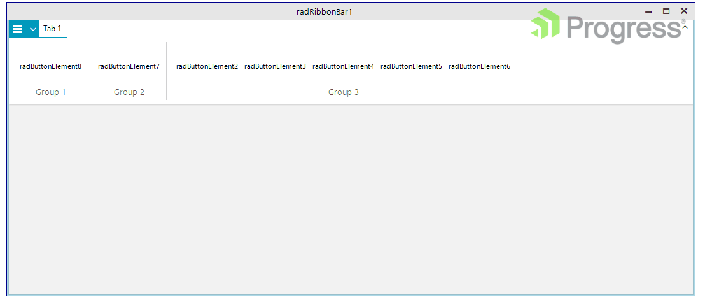

## Environment
 
|Product Version|Product|Author|
|----|----|----|
|2022.1.222|RadGridView for WinForms|[Dinko Krastev](https://www.telerik.com/blogs/author/dinko-krastev)|

## Description

To add a watermark image inside the RadRibbonBar control, we can create a custom class that derives from __RadRibbonBarElement__. The custom __RadRibbonBarElement__ will have an additional element that will paint the watermark (image). The important part here is that the newly created element will need to be arranged so that it is positioned per your requirements. In the following solution, we will place a watermark next to the system buttons.



## Solution

1. First we will create a custom RadRibbonBarElement and add a __LightVisualElement__ object which will host the image.

````C#

public class CustomRadRibbonBarElement : RadRibbonBarElement
{
	private LightVisualElement watermarkElement;

	protected override void InitializeFields()
	{
		base.InitializeFields();
	}

	protected override void OnLoaded()
	{
		base.OnLoaded();
		
		this.DrawFill = true;
		this.BackColor = Color.White;
		this.GradientStyle = GradientStyles.Solid;
		this.TabStripElement.BackColor = Color.Transparent;
	}

	protected override void CreateChildElements()
	{
		base.CreateChildElements();

		this.watermarkElement = new LightVisualElement();
		this.watermarkElement.StretchHorizontally = this.watermarkElement.StretchVertically = false;
		this.watermarkElement.ShouldHandleMouseInput = false;
		this.watermarkElement.NotifyParentOnMouseInput = true;

		this.Children.Add(this.watermarkElement);

	}

	protected override Type ThemeEffectiveType
	{
		get
		{
			return typeof(RadRibbonBarElement);
		}
	}

	public LightVisualElement WatermarkElement
	{
		get { return this.watermarkElement; }
	}

	public Image Watermark
	{
		get { return this.WatermarkElement.Image; }
		set { this.WatermarkElement.Image = value; }
	}

	protected override SizeF MeasureOverride(SizeF availableSize)
	{
		SizeF result = base.MeasureOverride(availableSize);

		this.watermarkElement.Measure(availableSize);
		return result;
	}

	protected override SizeF ArrangeOverride(SizeF finalSize)
	{
		SizeF result = base.ArrangeOverride(finalSize);
		
		RectangleF clientRect = this.GetClientRectangle(finalSize);
		RectangleF watermarkRect = new RectangleF();
		watermarkRect.X = clientRect.Right /*- this.RibbonCaption.SystemButtons.DesiredSize.Width*/ - this.WatermarkElement.DesiredSize.Width - this.WatermarkElement.Margin.Right;
		watermarkRect.Y = this.WatermarkElement.Margin.Top;
		watermarkRect.Size = this.WatermarkElement.DesiredSize;

		this.watermarkElement.Arrange(watermarkRect);

		return result;
	}
}	

````
````VB.NET

Public Class CustomRadRibbonBarElement
    Inherits RadRibbonBarElement

    Private watermarkElement As LightVisualElement

    Protected Overrides Sub InitializeFields()
        MyBase.InitializeFields()
    End Sub

    Protected Overrides Sub OnLoaded()
        MyBase.OnLoaded()
        Me.DrawFill = True
        Me.BackColor = Color.White
        Me.GradientStyle = GradientStyles.Solid
        Me.TabStripElement.BackColor = Color.Transparent
    End Sub

    Protected Overrides Sub CreateChildElements()
        MyBase.CreateChildElements()
        Me.watermarkElement = New LightVisualElement()
		Me.watermarkElement.StretchVertically = False
        Me.watermarkElement.StretchHorizontally = False
        Me.watermarkElement.ShouldHandleMouseInput = False
        Me.watermarkElement.NotifyParentOnMouseInput = True
        Me.Children.Add(Me.watermarkElement)
    End Sub

    Protected Overrides ReadOnly Property ThemeEffectiveType As Type
        Get
            Return GetType(RadRibbonBarElement)
        End Get
    End Property

    Public ReadOnly Property WatermarkElement As LightVisualElement
        Get
            Return Me.watermarkElement
        End Get
    End Property

    Public Property Watermark As Image
        Get
            Return Me.WatermarkElement.Image
        End Get
        Set(ByVal value As Image)
            Me.WatermarkElement.Image = value
        End Set
    End Property

    Protected Overrides Function MeasureOverride(ByVal availableSize As SizeF) As SizeF
        Dim result As SizeF = MyBase.MeasureOverride(availableSize)
        Me.watermarkElement.Measure(availableSize)
        Return result
    End Function

    Protected Overrides Function ArrangeOverride(ByVal finalSize As SizeF) As SizeF
        Dim result As SizeF = MyBase.ArrangeOverride(finalSize)
        Dim clientRect As RectangleF = Me.GetClientRectangle(finalSize)
        Dim watermarkRect As RectangleF = New RectangleF()
        watermarkRect.X = clientRect.Right - Me.WatermarkElement.DesiredSize.Width - Me.WatermarkElement.Margin.Right
        watermarkRect.Y = Me.WatermarkElement.Margin.Top
        watermarkRect.Size = Me.WatermarkElement.DesiredSize
        Me.watermarkElement.Arrange(watermarkRect)
        Return result
    End Function
End Class


````

{{endregion}} 

2. The final step is to replace the default __RadRibbonBarElement__ object with the custom one created above. 

````C#

public partial class RadForm1 : Telerik.WinControls.UI.RadForm
{
    public RadForm1()
    {
        InitializeComponent();
        this.radRibbonBar1.Watermark = Image.FromFile(@"..\..\progress320.png");
    }
}   

public class CustomRadRibbonBar : RadRibbonBar
{
    private CustomRadRibbonBarElement customRibbonBarElement;

    public override string ThemeClassName
    {
        get
        {
            return typeof(RadRibbonBar).FullName;
        }
    }

    protected override RadRibbonBarElement CreateRibbonBarElement()
	{
		customRibbonBarElement = new CustomRadRibbonBarElement();
		return customRibbonBarElement;
	}
	
	protected override void CreateChildItems(RadElement parent)
	{
		base.CreateChildItems(parent);
	}

    public Image Watermark
    {
        get { return this.customRibbonBarElement.Watermark; }
        set { this.customRibbonBarElement.Watermark = value; }
    }
}

````
````VB.NET

Public Partial Class RadForm1
    Inherits Telerik.WinControls.UI.RadForm

    Public Sub New()
        InitializeComponent()
        Me.radRibbonBar1.Watermark = Image.FromFile("..\..\progress320.png")
    End Sub
End Class

Public Class CustomRadRibbonBar
    Inherits RadRibbonBar

    Private customRibbonBarElement As CustomRadRibbonBarElement

    Public Overrides ReadOnly Property ThemeClassName As String
        Get
            Return GetType(RadRibbonBar).FullName
        End Get
    End Property

    Protected Overrides Function CreateRibbonBarElement() As RadRibbonBarElement
        customRibbonBarElement = New CustomRadRibbonBarElement()
        Return customRibbonBarElement
    End Function

    Protected Overrides Sub CreateChildItems(ByVal parent As RadElement)
        MyBase.CreateChildItems(parent)
    End Sub

    Public Property Watermark As Image
        Get
            Return Me.customRibbonBarElement.Watermark
        End Get
        Set(ByVal value As Image)
            Me.customRibbonBarElement.Watermark = value
        End Set
    End Property
End Class


````

{{endregion}} 


