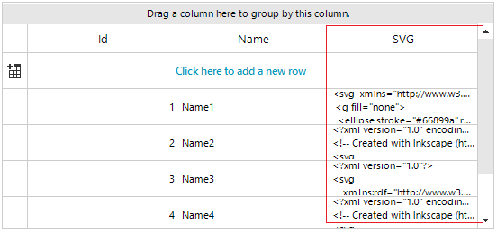
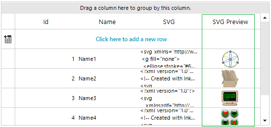

## Environment
|Product Version|Product|Author|
|----|----|----|
|2022.3.913|RadGridView for WinForms|[Desislava Yordanova](https://www.telerik.com/blogs/author/desislava-yordanova)|

## Description

Usually, the SVG (vector) images are stored as XML/text content in the database. When RadGridView is bound to such a DataTable, the text representation is displayed in the automatically generated column:

 
 
This article demonstrates a sample approach how add a grid column that supports SVG images. 

## Solution

It is necessary to create a derivative of **GridViewImageColumn** and use a custom cell element that shows the [SVG image](). The example relies on the fact that the cell's value contains the XML/text content of the image. The achieved result is illustrated in the following image:
 
 


````C#

public RadForm1()
{
    InitializeComponent();
    DataTable dt = new DataTable();
    dt.Columns.Add("Id", typeof(int));
    dt.Columns.Add("Name", typeof(string));
    dt.Columns.Add("SVG", typeof(string));

    string[] files = System.IO.Directory.GetFiles(@"..\..\..\svg files");
    int id = 0;
    foreach (string file in files)
    {
        string readText = System.IO.File.ReadAllText(file);
        id++;
        dt.Rows.Add(id, "Name" + id, readText);
    }

    this.radGridView1.DataSource = dt;
    SvgColumn svgColumn = new SvgColumn();
    svgColumn.HeaderText = "SVG Preview";
    svgColumn.FieldName = "SVG";
    this.radGridView1.Columns.Add(svgColumn);
    this.radGridView1.AutoSizeColumnsMode = GridViewAutoSizeColumnsMode.Fill;
    this.radGridView1.TableElement.RowHeight = 40;
}

public class SvgColumn : GridViewImageColumn
{
    public override Type GetCellType(GridViewRowInfo row)
    {
        if (row is GridViewDataRowInfo || row is GridViewNewRowInfo)
        {
            return typeof(SvgCellElement);
        }
        return base.GetCellType(row);
    }
}

public class SvgCellElement : GridImageCellElement
{ 
    public SvgCellElement(GridViewColumn column, GridRowElement row) : base(column, row)
    {
    }

    protected override Type ThemeEffectiveType     
    { 
        get    
        { 
            return typeof(GridImageCellElement);     
        }
    }

    protected override void SetContentCore(object value)
    {
        base.SetContentCore(value);
        if (this.Value != null)
        {
            this.ImageDrawType = Telerik.WinControls.ImageDrawType.Svg;
            this.ImageLayout = System.Windows.Forms.ImageLayout.Zoom;
            if (this.RowInfo.Tag == null)
            {
                this.RowInfo.Tag = RadSvgImage.FromXml(this.Value + "");
            }
            this.SvgImage = this.RowInfo.Tag as RadSvgImage;
        }
    }
}

````
````VB.NET

Public Sub New()
    InitializeComponent()
    Dim dt As DataTable = New DataTable()
    dt.Columns.Add("Id", GetType(Integer))
    dt.Columns.Add("Name", GetType(String))
    dt.Columns.Add("SVG", GetType(String))
    Dim files As String() = System.IO.Directory.GetFiles("..\..\..\svg files")
    Dim id As Integer = 0

    For Each file As String In files
        Dim readText As String = System.IO.File.ReadAllText(file)
        id += 1
        dt.Rows.Add(id, "Name" & id, readText)
    Next

    Me.RadGridView1.DataSource = dt
    Dim svgColumn As SvgColumn = New SvgColumn()
    svgColumn.HeaderText = "SVG Preview"
    svgColumn.FieldName = "SVG"
    Me.RadGridView1.Columns.Add(svgColumn)
    Me.RadGridView1.AutoSizeColumnsMode = GridViewAutoSizeColumnsMode.Fill
    Me.RadGridView1.TableElement.RowHeight = 40
End Sub

Public Class SvgColumn
    Inherits GridViewImageColumn

    Public Overrides Function GetCellType(ByVal row As GridViewRowInfo) As Type
        If TypeOf row Is GridViewDataRowInfo OrElse TypeOf row Is GridViewNewRowInfo Then
            Return GetType(SvgCellElement)
        End If

        Return MyBase.GetCellType(row)
    End Function
End Class

Public Class SvgCellElement
    Inherits GridImageCellElement

    Public Sub New(ByVal column As GridViewColumn, ByVal row As GridRowElement)
        MyBase.New(column, row)
    End Sub

    Protected Overrides ReadOnly Property ThemeEffectiveType As Type
        Get
            Return GetType(GridImageCellElement)
        End Get
    End Property

    Protected Overrides Sub SetContentCore(ByVal value As Object)
        MyBase.SetContentCore(value)

        If Me.Value IsNot Nothing Then
            Me.ImageDrawType = Telerik.WinControls.ImageDrawType.Svg
            Me.ImageLayout = System.Windows.Forms.ImageLayout.Zoom

            If Me.RowInfo.Tag Is Nothing Then
                Me.RowInfo.Tag = RadSvgImage.FromXml(Me.Value & "")
            End If

            Me.SvgImage = TryCast(Me.RowInfo.Tag, RadSvgImage)
        End If
    End Sub
End Class

````

>caution Please have in mind that the complexity of the vector images and the number of records may affect the rows resizing or scrolling performance. 

# See Also

* [Vector Images Support]()
* [GridViewImageColumn]()


 
