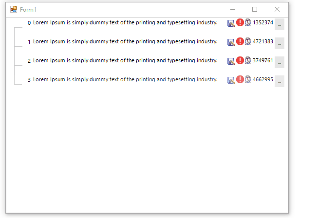

## Environment
|Product Version|Product|Author|
|----|----|----|
|2023.1.314|RadTreeView for WinForms|[Dinko Krastev](https://www.telerik.com/blogs/author/dinko-krastev)|


## Description

By design, **RadTreeView** allows customizing the visual node elements. The [Custom Nodes]() help article demonstrates a step-by-step tutorial on how to use a custom **TreeNodeElement**. However, a common scenario is to use several elements in a custom node. In this example, we will demonstrate how to arrange elements in a custom node in a way that changing the width of the control will change only the text part while the rest elements will stay static.



## Solution

For the purpose of this article, we will populate the RadTreeView with sample data. In the code snippet, you can observe that we need to subscribe to the CreateNodeElement event. In the event handler, you can replace the default node element with a custom one.

````C#

public partial class Form1 : Form
{
    BindingList<TreeItem> treeItems = new BindingList<TreeItem>();
    Random rnd = new Random();
    public Form1()
    {
        InitializeComponent();
        this.radTreeView1.ItemHeight = 40;
        this.radTreeView1.ShowLines = true;
        this.radTreeView1.TreeIndent = 32;
        for (int i = 0; i < 4; i++)
        {
            treeItems.Add(new TreeItem() { Id = i, Name = "Lorem Ipsum is simply dummy text of the printing and typesetting industry.", Price= rnd.Next(1000000,5000000) });
        }
        this.radTreeView1.DataSource = treeItems;
        this.radTreeView1.CreateNodeElement += RadTreeView1_CreateNodeElement;
    }

    private void RadTreeView1_CreateNodeElement(object sender, Telerik.WinControls.UI.CreateTreeNodeElementEventArgs e)
    {
        e.NodeElement = new CustomTreeNodeElement();
    }
}
public class TreeItem
{
    public int Id { get; set; }
    public string Name { get; set; }
    public decimal Price { get; set; }

}


````
````VB.NET

Public Partial Class Form1
    Inherits Form

    Private treeItems As BindingList(Of TreeItem) = New BindingList(Of TreeItem)()
    Private rnd As Random = New Random()

    Public Sub New()
        InitializeComponent()
        Me.radTreeView1.ItemHeight = 40
        Me.radTreeView1.ShowLines = True
        Me.radTreeView1.TreeIndent = 32

        For i As Integer = 0 To 4 - 1
            treeItems.Add(New TreeItem() With {
                .Id = i,
                .Name = "Lorem Ipsum is simply dummy text of the printing and typesetting industry.",
                .Price = rnd.[Next](1000000, 5000000)
            })
        Next

        Me.radTreeView1.DataSource = treeItems
        AddHandler Me.radTreeView1.CreateNodeElement, AddressOf RadTreeView1_CreateNodeElement
    End Sub

    Private Sub RadTreeView1_CreateNodeElement(ByVal sender As Object, ByVal e As Telerik.WinControls.UI.CreateTreeNodeElementEventArgs)
        e.NodeElement = New CustomTreeNodeElement()
    End Sub
End Class

Public Class TreeItem
    Public Property Id As Integer
    Public Property Name As String
    Public Property Price As Decimal
End Class


````

Now we need to create our custom node. We will add different types of elements inside the custom node. Each element will represent data related to the current node. In our case, only the __nameElement__ TextPrimitive part will depend on its parent node width, while the rest of the elements will not overlap each other and stay static. An important step here is to set __TextWrap__ and __AutoEllipsis__ properties of the TextPrimitive__. To arrange the elements correctly you need to override the __ArrangeOverride__ method of the __CustomContentElement__. In the method, you can calculate the width of all elements except the text part element. The width of the TextPrimitive element will be the remaining space left from the whole node width, without the width of the other elements.

````C#

public class CustomTreeNodeElement : TreeNodeElement
{
    protected override Type ThemeEffectiveType
    {
        get
        {
            return typeof(TreeNodeElement);
        }
    }
    protected override TreeNodeContentElement CreateContentElement()
    {
        return new CustomContentElement();
    }
}

public class CustomContentElement : TreeNodeContentElement
{
    LightVisualElement numberElement;
    TextPrimitive nameElement;
    ImagePrimitive saveStatusImage;
    ImagePrimitive errorImage;
    ImagePrimitive timeImage;
    TextPrimitive priceText;
    RadDropDownButtonElement detailsButton;
    public override void Synchronize()
    {
        TreeNodeElement treeNodeElement = this.NodeElement;
        RadTreeNode node = treeNodeElement.Data;
        TreeItem dataItem = (TreeItem)node.DataBoundItem;
        numberElement.Text = dataItem.Id + "";
        nameElement.Text = dataItem.Name;
        priceText.Text = dataItem.Price + "";
    }

    protected override void CreateChildElements()
    {
        this.StretchHorizontally = true;

        this.numberElement = new LightVisualElement();
        this.Children.Add(this.numberElement);

        this.nameElement = new TextPrimitive()
        {
            TextWrap = true,
            AutoEllipsis = true,
        };
        this.Children.Add(this.nameElement);

        this.saveStatusImage = new ImagePrimitive()
        {
            Image = Resources.save_as1,
        };
        this.Children.Add(this.saveStatusImage);

        this.errorImage = new ImagePrimitive()
        {
            Image = Resources.error,
        };
        this.Children.Add(this.errorImage);

        this.timeImage = new ImagePrimitive()
        {
            Image = Resources.Alarm,
        };
        this.Children.Add(this.timeImage);

        this.priceText = new TextPrimitive();
        this.Children.Add(this.priceText);

        this.detailsButton = new RadDropDownButtonElement()
        {
            Text = "...",
            ShowArrow = false
        };
        this.Children.Add(this.detailsButton);
    }

    protected override SizeF ArrangeOverride(SizeF finalSize)
    {
        var availableSize = base.ArrangeOverride(finalSize);
        var width = this.numberElement.DesiredSize.Width + this.saveStatusImage.DesiredSize.Width + this.errorImage.DesiredSize.Width + this.timeImage.DesiredSize.Width + this.priceText.DesiredSize.Width + this.detailsButton.DesiredSize.Width;

        if (width < availableSize.Width)
        {
            PointF topLeftCorner = new PointF(0, 0);
            this.numberElement.Arrange(new RectangleF(topLeftCorner, numberElement.DesiredSize));
            topLeftCorner = new PointF(topLeftCorner.X + this.numberElement.DesiredSize.Width, 0);

            var nameWidth = availableSize.Width - width;
            nameElement.Arrange(new RectangleF(topLeftCorner, new SizeF(nameWidth, nameElement.DesiredSize.Height)));
            topLeftCorner = new PointF(topLeftCorner.X + nameWidth, 0);

            saveStatusImage.Arrange(new RectangleF(topLeftCorner, saveStatusImage.DesiredSize));
            topLeftCorner = new PointF(topLeftCorner.X + this.saveStatusImage.DesiredSize.Width, 0);

            errorImage.Arrange(new RectangleF(topLeftCorner, errorImage.DesiredSize));
            topLeftCorner = new PointF(topLeftCorner.X + this.errorImage.DesiredSize.Width, 0);

            timeImage.Arrange(new RectangleF(topLeftCorner, timeImage.DesiredSize));
            topLeftCorner = new PointF(topLeftCorner.X + this.timeImage.DesiredSize.Width, 0);

            priceText.Arrange(new RectangleF(topLeftCorner, priceText.DesiredSize));
            topLeftCorner = new PointF(topLeftCorner.X + this.priceText.DesiredSize.Width, 0);

            detailsButton.Arrange(new RectangleF(topLeftCorner, detailsButton.DesiredSize));
        }

        return availableSize;
    }
    protected override Type ThemeEffectiveType
    {
        get
        {
            return typeof(TreeNodeContentElement);
        }
    }
}


````
````VB.NET


````

# See Also

 * [TreeView Overview]()
 * [Binding to Database Data]()
 * [Custom Nodes]()

