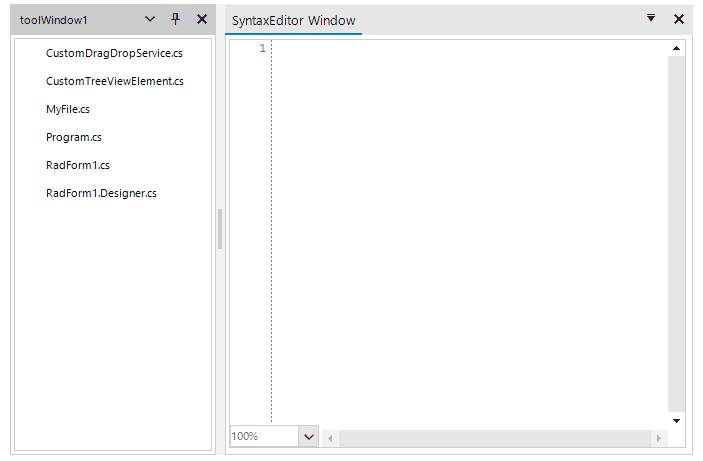

## Environment
|Product Version|Product|Author|
|----|----|----|
|2022.2.622|Scheduler for WinForms|[Dinko Krastev](https://www.telerik.com/blogs/author/dinko-krastev)|


## Description

In this example, we will demonstrate how to drag drop RadTreeView nodes and show files in __RadSyntaxEditor__ on drop operation. In this case, both controls are placed inside __RadDock__.



## Solution 

1. To make this work, first, we need to override GetDropTarget() method of the default __TreeViewDragDropService__ of the RadTreeView. Inside the method, we need to find if there is a RadSyntaxEditor control on the drop position.


````C#

public class CustomTreeView : RadTreeView
{
    //Replace the default element with the custom one
    protected override RadTreeViewElement CreateTreeViewElement()
    {
        return new CustomTreeViewElement();
    }

    //Enable theming for the control
    public override string ThemeClassName
    {
        get
        {
            return typeof(RadTreeView).FullName;
        }
    }
}

public class CustomTreeViewElement : RadTreeViewElement
{
    //Enable themeing for the element
    protected override Type ThemeEffectiveType
    {
        get
        {
            return typeof(RadTreeViewElement);
        }
    }
    protected override TreeViewDragDropService CreateDragDropService()
    {
        return new CustomDragDropService(this);
    }
}

public class CustomDragDropService : TreeViewDragDropService
{
    public CustomDragDropService(RadTreeViewElement owner) : base(owner) { }
    protected override Telerik.WinControls.ISupportDrop GetDropTarget(Point mousePosition, out Point resultDropLocation)
    {
        ISupportDrop dropTarget = base.GetDropTarget(mousePosition, out resultDropLocation);
        if (dropTarget == null)
        {
            ComponentThemableElementTree elementTree = this.ElementTreeFromPoint(mousePosition);
            if (elementTree != null )
            {
                RadSyntaxEditor syntaxEditor = elementTree.Control as RadSyntaxEditor;
                if (syntaxEditor != null)
                {
                    return syntaxEditor.SyntaxEditorElement;
                }
            }
        }
        return dropTarget;
    }

    private ComponentThemableElementTree ElementTreeFromPoint(Point mousePosition)
    {
        IntPtr hitWindow = NativeMethods.WindowFromPoint(mousePosition.X, mousePosition.Y);

        if (hitWindow == IntPtr.Zero)
        {
            return null;
        }

        Control hitControl = Control.FromHandle(hitWindow);

        while (hitControl != null)
        {
            IComponentTreeHandler treeHandler = hitControl as IComponentTreeHandler;

            if (treeHandler != null)
            {
                return treeHandler.ElementTree;
            }

            hitControl = hitControl.Parent;
        }
        return null;
    }
}


````
````VB.NET

Public Class CustomTreeView
    Inherits RadTreeView

    Protected Overrides Function CreateTreeViewElement() As RadTreeViewElement
        Return New CustomTreeViewElement()
    End Function

    Public Overrides ReadOnly Property ThemeClassName As String
        Get
            Return GetType(RadTreeView).FullName
        End Get
    End Property
End Class

Public Class CustomTreeViewElement
    Inherits RadTreeViewElement

    Protected Overrides ReadOnly Property ThemeEffectiveType As Type
        Get
            Return GetType(RadTreeViewElement)
        End Get
    End Property

    Protected Overrides Function CreateDragDropService() As TreeViewDragDropService
        Return New CustomDragDropService(Me)
    End Function
End Class

Public Class CustomDragDropService
    Inherits TreeViewDragDropService

    Public Sub New(ByVal owner As RadTreeViewElement)
        MyBase.New(owner)
    End Sub

    Protected Overrides Function GetDropTarget(ByVal mousePosition As Point, <Out> ByRef resultDropLocation As Point) As Telerik.WinControls.ISupportDrop
        Dim dropTarget As ISupportDrop = MyBase.GetDropTarget(mousePosition, resultDropLocation)

        If dropTarget Is Nothing Then
            Dim elementTree As ComponentThemableElementTree = Me.ElementTreeFromPoint(mousePosition)

            If elementTree IsNot Nothing Then
                Dim syntaxEditor As RadSyntaxEditor = TryCast(elementTree.Control, RadSyntaxEditor)

                If syntaxEditor IsNot Nothing Then
                    Return syntaxEditor.SyntaxEditorElement
                End If
            End If
        End If

        Return dropTarget
    End Function

    Private Function ElementTreeFromPoint(ByVal mousePosition As Point) As ComponentThemableElementTree
        Dim hitWindow As IntPtr = NativeMethods.WindowFromPoint(mousePosition.X, mousePosition.Y)

        If hitWindow = IntPtr.Zero Then
            Return Nothing
        End If

        Dim hitControl As Control = Control.FromHandle(hitWindow)

        While hitControl IsNot Nothing
            Dim treeHandler As IComponentTreeHandler = TryCast(hitControl, IComponentTreeHandler)

            If treeHandler IsNot Nothing Then
                Return treeHandler.ElementTree
            End If

            hitControl = hitControl.Parent
        End While

        Return Nothing
    End Function
End Class


````


2. The next step is to create our RadDock control with two windows. In the first one, we can place it inside the RadTreeView control (replaced with the custom one above). We can populate the treeview with nodes pointing to files from the same project. In the second window, we can add RadSyntaxEditor which we are going to use for editing purposes. What's left is to subscribe to the PreviewDragOver and PreviewDragDrop events of the custom DragDropService. In these events, we can allow drop operation only when you are over RadSyntaxEditor and if a drop occurs we can show the document in the control.

````C#

public class MyFile
{
	public MyFile(string fullPath, string name)
	{
		this.FullPath = fullPath;
		this.Name = name;
	}

	public string FullPath
	{
		get;
		set;
	}

	public string Name
	{
		get;
		set;
	}
}

public partial class RadForm1 : Telerik.WinControls.UI.RadForm
{
    BindingList<MyFile> myFiles = new BindingList<MyFile>();
    public RadForm1()
    {
        InitializeComponent();
        customTreeView.AllowDragDrop = true;
        customTreeView.MultiSelect = true;
        this.radSyntaxEditor1.AllowDrop = true;
        PopulateRadTreeView();
        this.customTreeView.TreeViewElement.DragDropService.PreviewDragOver += DragDropService_PreviewDragOver;
        this.customTreeView.TreeViewElement.DragDropService.PreviewDragDrop += DragDropService_PreviewDragDrop;
    }

    private void PopulateRadTreeView()
    {
        string[] filePaths = Directory.GetFiles(@"../../").Where(x=>x.EndsWith(".cs")).ToArray();
        foreach (var item in filePaths)
        {
            myFiles.Add(new MyFile(item,item.Remove(0,6)));
                
        }
        customTreeView.DataSource = myFiles;
        customTreeView.DisplayMember = "Name";
    }

    private void DragDropService_PreviewDragDrop(object sender, RadDropEventArgs e)
    {
        TreeNodeElement draggedNodeElement = e.DragInstance as TreeNodeElement;
        if (draggedNodeElement == null)
        {
            return;
        }
        e.Handled = true;
        var myFile = draggedNodeElement.Data.DataBoundItem as MyFile;
        using (StreamReader reader = new StreamReader(myFile.FullPath))
        {
            this.radSyntaxEditor1.Document = new TextDocument(reader);
        }
    }

    private void DragDropService_PreviewDragOver(object sender, Telerik.WinControls.RadDragOverEventArgs e)
    {
        if (e.HitTarget is RadSyntaxEditorElement )
        {
            e.CanDrop = true;
        }
        else
        {
            e.CanDrop = false;
        }
    }
}


````
````VB.NET


Public Class MyFile
    Public Sub New(ByVal fullPath As String, ByVal name As String)
        Me.FullPath = fullPath
        Me.Name = name
    End Sub

    Public Property FullPath As String
    Public Property Name As String
End Class

Public Partial Class RadForm1
    Inherits Telerik.WinControls.UI.RadForm

    Private myFiles As BindingList(Of MyFile) = New BindingList(Of MyFile)()

    Public Sub New()
        InitializeComponent()
        customTreeView.AllowDragDrop = True
        customTreeView.MultiSelect = True
        Me.radSyntaxEditor1.AllowDrop = True
        PopulateRadTreeView()
        AddHandler Me.customTreeView.TreeViewElement.DragDropService.PreviewDragOver, AddressOf DragDropService_PreviewDragOver
        AddHandler Me.customTreeView.TreeViewElement.DragDropService.PreviewDragDrop, AddressOf DragDropService_PreviewDragDrop
    End Sub

    Private Sub PopulateRadTreeView()
        Dim filePaths As String() = Directory.GetFiles("../../").Where(Function(x) x.EndsWith(".cs")).ToArray()

        For Each item In filePaths
            myFiles.Add(New MyFile(item, item.Remove(0, 6)))
        Next

        customTreeView.DataSource = myFiles
        customTreeView.DisplayMember = "Name"
    End Sub

    Private Sub DragDropService_PreviewDragDrop(ByVal sender As Object, ByVal e As RadDropEventArgs)
        Dim draggedNodeElement As TreeNodeElement = TryCast(e.DragInstance, TreeNodeElement)

        If draggedNodeElement Is Nothing Then
            Return
        End If

        e.Handled = True
        Dim myFile = TryCast(draggedNodeElement.Data.DataBoundItem, MyFile)

        Using reader As StreamReader = New StreamReader(myFile.FullPath)
            Me.radSyntaxEditor1.Document = New TextDocument(reader)
        End Using
    End Sub

    Private Sub DragDropService_PreviewDragOver(ByVal sender As Object, ByVal e As Telerik.WinControls.RadDragOverEventArgs)
        If TypeOf e.HitTarget Is RadSyntaxEditorElement Then
            e.CanDrop = True
        Else
            e.CanDrop = False
        End If
    End Sub
End Class


````


# See Also

* [TreeViewDragDropService]()
* [Modify the DragDropService behavior]()

 

