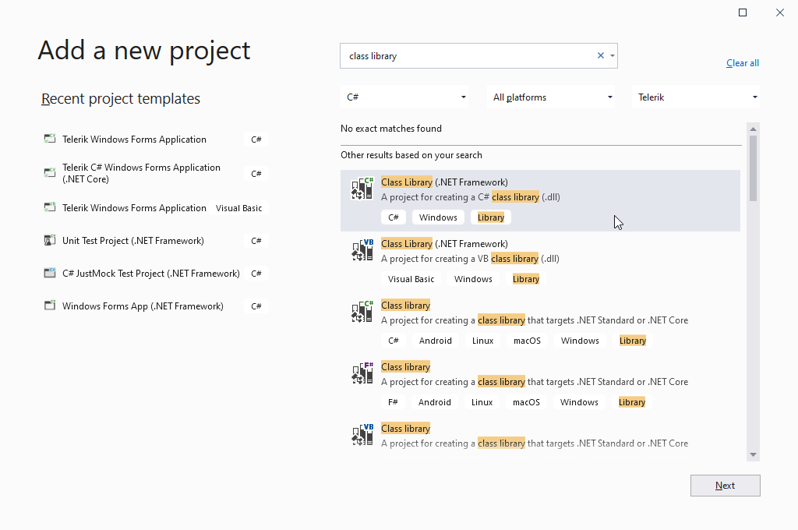
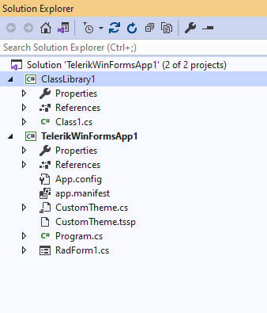
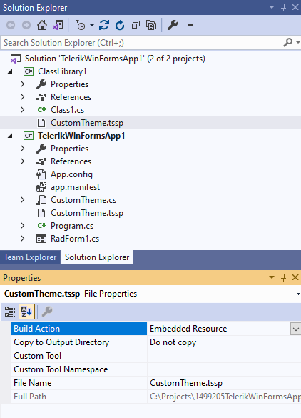
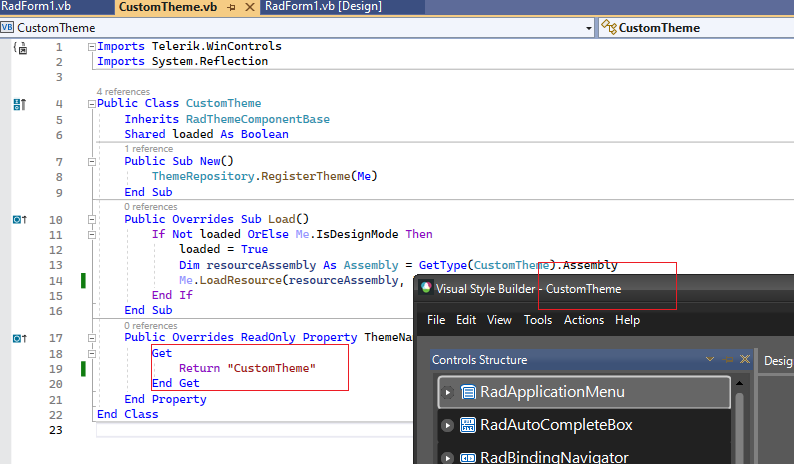
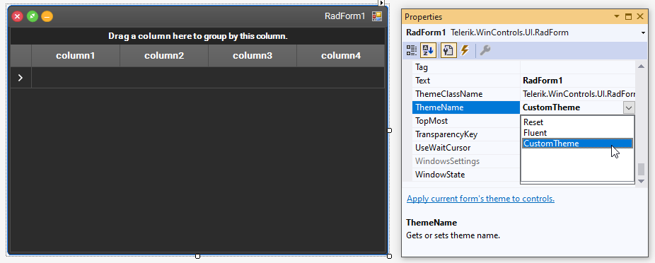

## Environment
|Product Version|Product|Author|
|----|----|----|
|2022.3.913|RadGridView for WinForms|[Desislava Yordanova](https://www.telerik.com/blogs/author/desislava-yordanova)|

## Description

This tutorial demonstrates a step by step tutorial how to create a theme component and integrate your [custom theme]() inside the project. Thus, the theme will be available at design time as well. 

## Solution

Follow the steps:

1\. Add a new Class Library project to your current solution.

 

 

 

2\. Then, the custom .tssp file should be added to the Class Library. 

>caution The custom .tssp file should be added with **Build Action - Embedded Resource**.

 

3\. Add a new class to represent your theme component to the project:

````C#

public class CustomTheme : RadThemeComponentBase
{
    static bool loaded;
    public CustomTheme()
    {
        ThemeRepository.RegisterTheme(this);
    }
    public override void Load()
    {
        if (!loaded || this.IsDesignMode)
        {
            loaded = true;
            Assembly resourceAssembly = typeof(CustomTheme).Assembly;
            this.LoadResource(resourceAssembly, "ProjectDefaultNamespace.ContainingFolderName.CustomTheme.tssp");
        }
    }
    public override string ThemeName
    {
        get { return "CustomTheme"; }
    }
}

````
````VB.NET

Public Class CustomTheme
    Inherits RadThemeComponentBase
    Shared loaded As Boolean
    Public Sub New()
        ThemeRepository.RegisterTheme(Me)
    End Sub
    Public Overrides Sub Load()
        If Not loaded OrElse Me.IsDesignMode Then
            loaded = True
            Dim resourceAssembly As Assembly = GetType(CustomTheme).Assembly
            Me.LoadResource(resourceAssembly, "ProjectDefaultNamespace.ContainingFolderName.CustomTheme.tssp")
        End If
    End Sub
    Public Overrides ReadOnly Property ThemeName() As String
        Get
            Return "CustomTheme"
        End Get
    End Property
End Class

````

>caution Please make sure that the theme name in Visual Style Builder corresponds to the name you are returning in the theme component.

 
 
4\. Build the entire application. The theme component will be available in the toolbox. You will be able to drag this component to the forms in all the projects in you solution which will load the corresponding theme.

 

 


# See Also

* [Creating a theme component]()
* [How to Customize a Theme]()


 