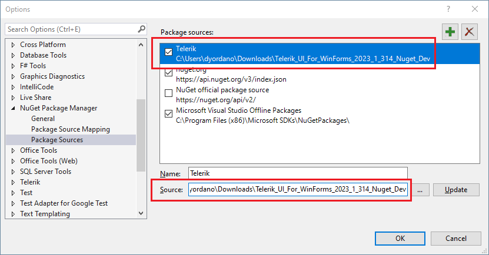

# Install using NuGet Packages

<iframe width="800" height="400" src="https://www.youtube.com/embed/c3m_BLMXNDk" frameborder="0" allow="accelerometer; autoplay; encrypted-media; gyroscope; picture-in-picture" allowfullscreen></iframe>

This article describes how you can install the WinForms suite using a NuGet package. There are two ways for getting the NuGet packages:

* [Manually download the packages](#manually-download-nuget-packages)

* [Get the packages from the Telerik NuGet server](#download-from-the-nuget-server)

>important The NuGet packages for Telerik UI for WinForms are created with a newer version of nuget.exe since R1 2018. If Visual Studio 2012 is used and the version of NuGet Package Manager is below 2.8, it won`t be able to install the NuGet packages. The possible solution is to update the version of NuGet Package Manager following these steps: 
1\. Open Visual Studio 2012 
2\. Tools >> Extensions and Updates 
3\. Updates >> Visual Studio gallery 
4\. NuGet Package Manager >> Update 
>

## Manually Download NuGet Packages

1. First you need to log in using your licensed account. This way you will be able to download the packages:

	

	>tip The following article shows where you can find the downloads section [Download Product Files](https://docs.telerik.com/devtools/winforms/installation-and-upgrades/download-product-files)
	
1. Then you need to add packages to Visual Studio. Open the NuGet manager and then click the options button:
	
	

1. Add new package source. The __Source__ should point to the folder with the NuGets:
	
	

1. The final step is to select and install the desired packages. Please note that there are two versions, one for .NET 2.0 to 3.5 and one for 2.0 or newer. 

## Download from the NuGet server

You need to add the Telerik package server (**https://nuget.telerik.com/v3/index.json**) to the package sources in visual studio.

>caution The old **https://nuget.telerik.com/nuget** server will be deprecated and we encourage our clients to switch to the v3 API. The new v3 API is faster, lighter, and reduces the number of requests from NuGet clients.  

1. First open the __Options__ window: 

	

1. Add new source and add the server to the Source field:

	

1. When the __Package Source__ is selected you will be prompted for a user name and a password. Use the credentials for your Telerik Account:

	

1. Then you can just select and install the desired NuGet packages.

    

# See Also

* [Installing On Your Computer]()
* [How to Upgrade a Telerik UI for WinForms Project]()
* [Install NuGet Key]()
